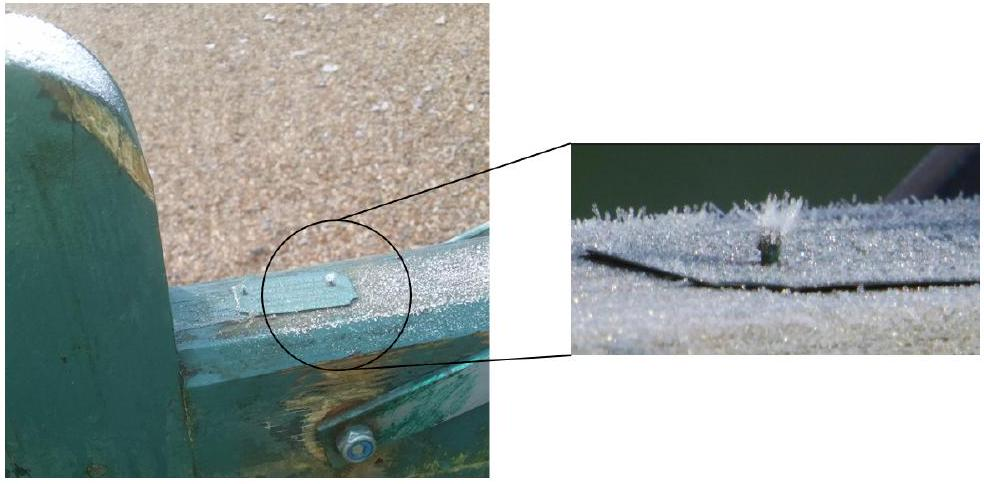
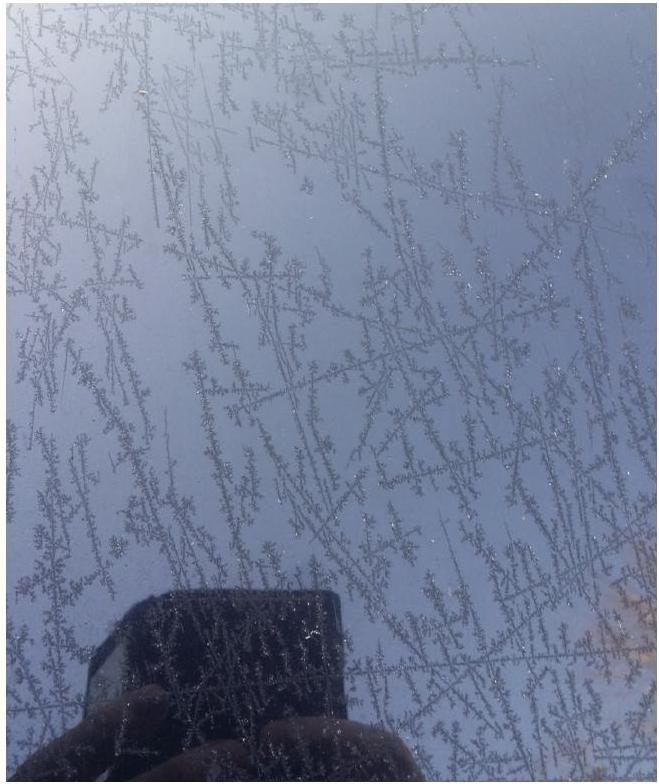
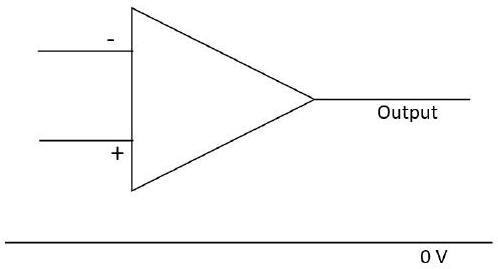
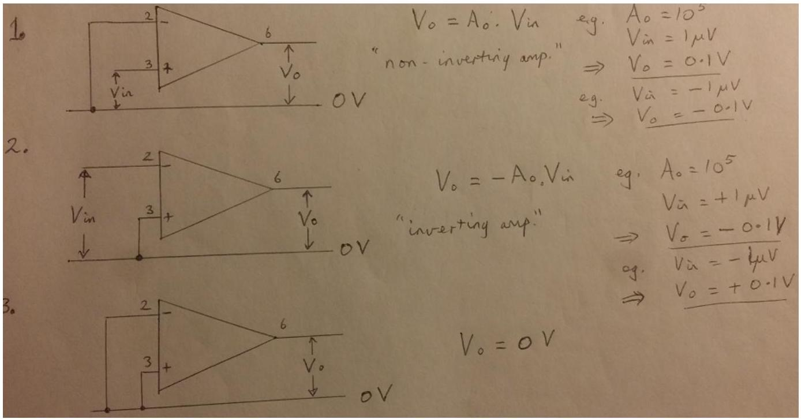
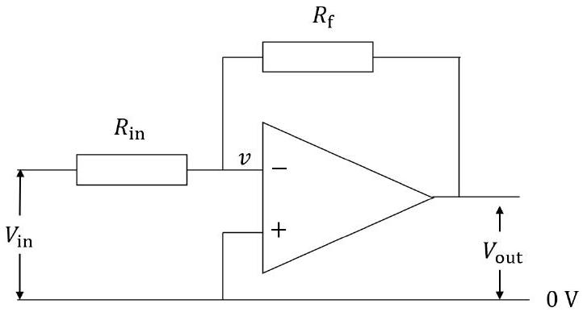
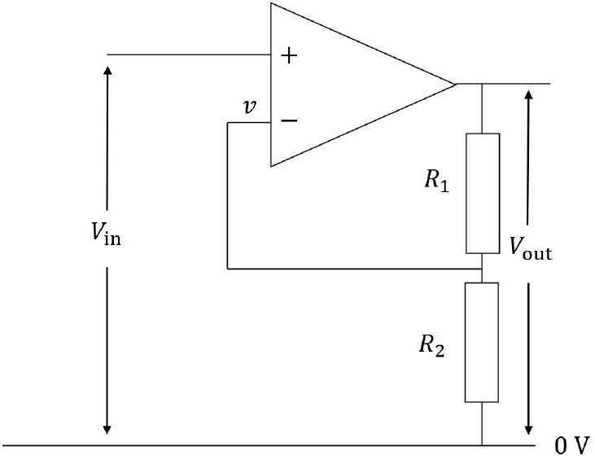
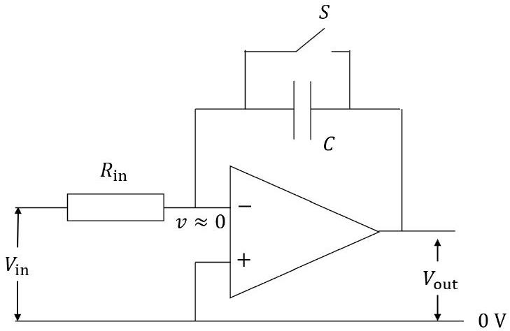

## Qu 1. General Questions

(a) . Air bubbles in water are observed to rise towards the surface at different speeds according to their initial size. Use your knowledge of physics to suggest an explanation.
(b) . Walking out of the front door on a cold, frosty morning, two effects are observed outside.
    (i) A nail, hammered in to the wooden gate, has a splay of ice crystals growing from it, shown in Fig. 1. With a few brief statements, suggest a possible explanation of this effect.

Figure 1: Ice crystals formed on a nail in a wooden fence on a frosty morning.

(ii) The windscreen of a car has a pattern on it, as in Fig. 2, which is not scratches on the glass, but ice. Again, with a few brief statements, suggest a possible explanation of this effect.

Figure 2: Ice crystals forming a pattern on the windscreen of a car on a cold, dry morning.

(c) . Estimate the number of peas (the small, green edible vegetable) that are consumed in the UK in a year.
(d) . A voltage amplifier of the type known as an op-amp consists of an integrated circuit constructed from many elements (transistors, resistors, etc.). Its internal workings are unimportant in this question. It is symbolised by a triangle with two inputs and an output, as shown in Fig. 3. It has a dc power supply to enable it to work, but that is not shown. The signal input terminals are labelled + and -, which is a notation and not the polarity of voltage supplied. They are respectively the

Figure 3: op-amp.

non-inverting input and the inverting input. We will assume a perfectly adjusted op-amp in order to make the following simplified statements.

- If the two inputs are connected together, the output is 0 V.
- If the inverting input (-) is set to 0 V then a small voltage, $V_{\text {in }}$, applied to the non-inverting input (+) will produce an output voltage $A_{0} V_{\text {in }}$ where $A_{0}$ is the open-loop gain and $A_{0} \gg 1$ ( $A_{0}$ is typically of order $10^{5}-10^{6}$ ). If $V_{\text {in }}$ is not small, then the output will saturate at the supply voltage and not at $A_{0} V_{\text {in }}$.
- If the non-inverting input (+) is set to 0 V, and a small voltage $V_{\text {in }}$ is applied to the inverting input (-) then the output voltage will be $-A_{0} V_{\text {in }}$.

Three examples are shown in Fig. 4. The op-amp is rarely used in this simple manner as the $A_{0}$ is

Figure 4: Three op-amp examples of the input and output values.

large but not known precisely. So usually, a small fraction of the output signal is fed back to the input and, as we shall see, this controls the gain of $A_{g}$ of the circuit ( $A_{0}$ is for the op-amp alone).

(i) In the circuit shown in Fig. 5, we can assume that negligible current enters the inverting terminal.
    i. Copy the circuit and sketch the path of the current $i$ that flows into the circuit at $V_{\text {in }}$ through the pair of resistors to $V_{\text {out }}$.
    ii. Given that the non-inverting input is at 0 V, and that the (small) potential at the inverting input is given by $v=-\frac{V_{\text {out }}}{A_{0}}$, obtain equations for the current $i$ flowing through $R_{\text {in }}$ in terms of $V_{\text {out }}, V_{\text {in }}$ and $A_{0}$, and the same current $i$ through $R_{\mathrm{f}}$ in terms of these quantities.

iii. Eliminating the current $i$ between these two equations, obtain an expression for $A_{g}=\frac{V_{\text {out }}}{V_{\text {in }}}$.
iv. For $A_{0} \gg 1$, obtain an expression for $A_{g}$ in terms of $R_{\mathrm{f}}$ and $R_{\text {in }}$.

Figure 5: Inverting amplifier circuit with feedback from the output to the inverting input.

(ii) For the non-inverting amplifier of Fig. 6 the non-inverting input is now at $V_{\text {in }}$ whilst the inverting input is again at potential $v$ given by $V_{\text {out }}=A_{0}\left(V_{\text {in }}-v\right)$. A current $i$ flows from the output down to 0 V with no current entering the inverting input.
    i. Write down equations for the current $i$ flowing through $R_{1}$ and $R_{2}$ in terms of $V_{\text {out }}$, and the same current through $R_{2}$ in terms of $v$.
    ii. Eliminating the current $i$ between these two equations, obtain an expression for $A_{g}=\frac{V_{\text {out }}}{V_{\text {in }}}$.
    iii. For $A_{0} \gg 1$, obtain an expression for $A_{g}$ in terms of $R_{1}$ and $R_{2}$ only.

Figure 6: Non-inverting amplifier circuit with feedback from the output again to the inverting input.

(iii) In the following circuit, we assume that $A_{0} \gg 1$ and so $v$ is small enough that the two inputs can be taken to be the same value and $v \approx 0$, and also that no current enters the op-amp inputs (these are the two "Golden Rules" for op-amps).
For the circuit of Fig. 7 a current $i$ flows through $R_{\text {in }}$ and onto the capacitor when switch S is opened at time $t=0$. No current enters the inverting input.
    i. Obtain equations for the current $i$ in terms of $R_{\text {in }}$ and $V_{\text {in }}$, and then the charge $Q$ on the capacitor in terms of $C$ and $V_{\text {out }}$.
    ii. Obtain a differential equation $\frac{d V_{\text {out }}}{d t}$ which can then be expressed in terms of $V_{\text {in }}, R_{\text {in }}$ and $C$. Solve this for $V_{\text {out }}$ in terms $V_{\text {in }}$.

Figure 7: Circuit with feedback via a capacitor to the inverting input.

iii. Sketch a graph of $V_{\text {out }}$ against time, $t$.
