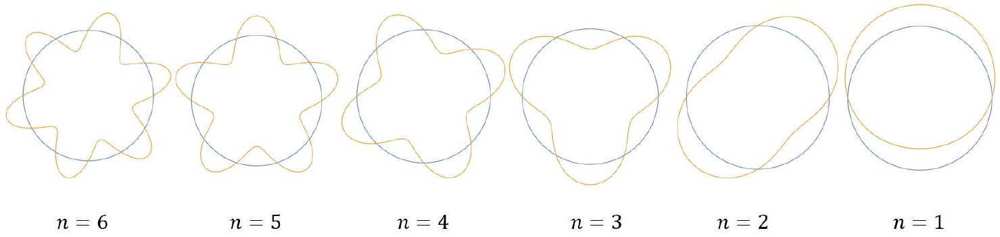

## Qu 2. Energy Levels

This question explores energy levels in atoms. The model is interesting both from a historical perspective and as an example of where classical physics meets quantum physics.

(a). In a simple model of the hydrogen atom due to Bohr and de Broglie, electrons are assumed to follow circular orbits around the nucleus with the wave-like nature of electrons manifest as resonant states or standing waves around a closed orbit, with the number of half-wavelengths given by the integer, $n$. This model of the orbits is illustrated in Fig. 8.

Figure 8: Bohr orbits, pictured as standing waves of an electron in a closed orbit around the nucleus.

    (i) Sketch the $n=3$ example shown and referring to your sketch, comment on what determines the value of $n$.
    (ii) By considering the electron simply as a particle of mass $m$ and charge $e$ orbiting the nucleus, derive an expression for the total energy of the system, $E$, in terms of the radius of the orbit of the electron around the nucleus, $r$

The energy of the electron in its orbit is dependent upon $r$, but there is no restriction on the value of $r$ or of $E$. Now, if we consider the electron as a de Broglie wave,

(iii) show that the wave-like nature illustrated in Fig. 8 leads to the quantisation condition
$$
r p=n \frac{h}{2 \pi}
$$
where $p$ is the momentum of the electron.
(iv) Determine the radius of the hydrogen atom that this predicts when $n=1$. Does it seem sensible?
(v) Determine the energy levels of atomic hydrogen, $E_{n}$, in this model. Calculate the ground state energy in eV.
(b) . In a slightly improved model, the electron and nucleus orbit their common centre of mass.
    (i) Show that the electron and nucleus orbit with a common angular velocity, $\omega$, and find an expression for $\omega$ in terms of $r$, the separation of the electron from the nucleus, and $\mu$, the so-called 'reduced mass'
$$
\mu=\frac{m M}{m+M}
$$
with $m$ the mass of the electron and $M$ the mass of the nucleus.
    (ii) The quantity $r p$ in (a).(iii) is the angular momentum of the electron. This is the 'moment of momentum' about the orbital centre. A generalisation of the quantisation condition arrived at previously has the total (sum of) angular momentum of the electron and nucleus quantised in units of $\frac{h}{2 \pi}$. Calculate the lowest two energy levels of both atomic hydrogen and atomic tritium in this model.
    (iii) Which of hydrogen and tritium would absorb a shorter wavelength of light for a given atomic transition? What is the difference between the two wavelengths?
