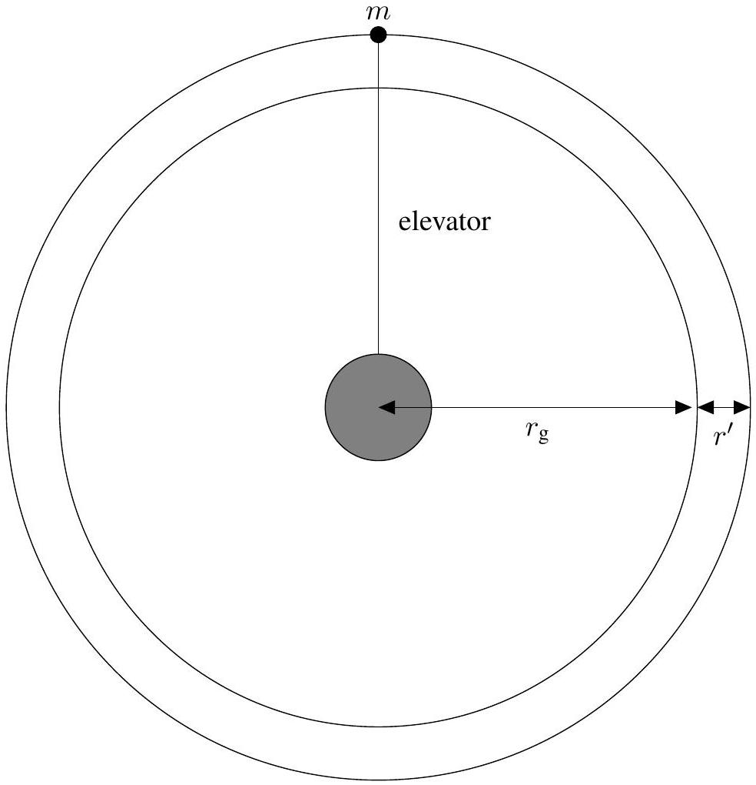

## Qu 4. A Space Elevator

This question explores the idea of a space elevator for reaching a high altitude orbit such as a geostationary one.

When considering the physics of rotating objects, a helpful way to analyse the motion can be to transform to a frame of reference which is rotating with the object, and in which the object is therefore (in the simplest case) at rest. When an object of mass $m$ is at rest in this frame of reference, and the reference frame is rotating uniformly with angular velocity $\omega$, the transformation to this frame gives rise to a fictitious 'centrifugal' force equal to $m r \omega^{2}$, where $r$ is the distance of the mass from the axis of rotation. The force is centrifugal in that it is directed away from the axis of rotation rather than towards it. To handle the laws of motion in such a rotating frame, simply treat the fictitious forces like real forces and go about things as usual!

(a) . Find an expression for the orbital time period for a satellite of mass $m_{\mathrm{s}}$ orbiting at a distance $r_{\mathrm{g}}$ from the centre of the earth. Calculate the radius of the orbit of a geostationary satellite.
(b) . A mass $m$ is to be kept in orbit at a radius $r_{\mathrm{g}}+r^{\prime}\left(r^{\prime} \ll r_{\mathrm{g}}\right)$ as shown in the diagram below. What extra force is required to do this over and above the gravitational force. Determine both its magnitude and direction.

(c) . An elevator is hung from the mass $m$ as shown in the diagram above and reaches all the way down to the surface of the earth. Modelling the elevator as a thin rod with mass per unit length $\mu$, show that for the elevator plus mass to maintain the same geostationary orbital period then the mass must (taking the radius of a geostationary orbit to be very much bigger than the radius of the earth) be given by
$$
m=\frac{\mu r_{\mathrm{g}}^{3}}{3 r_{\mathrm{e}} r^{\prime}}
$$
where $r_{\mathrm{e}}$ is the radius of the earth.
(d) . Using reasonable estimates for $\mu$ and $r^{\prime}$, comment on the viability of this proposal using standard materials.

(e) . Contemplate instead a 'free-standing' elevator without a counterweight, modelled as a uniform cable whose ends require no restraint. Again the cable rotates with the earth. Consider the net stress $\mathrm{d} \sigma$ on an element of cable $\mathrm{d} r$ with cross-sectional area $A$ at a distance $r$ from the centre of the earth. Show that
$$
\frac{\mathrm{d} \sigma}{\mathrm{~d} r}=G m_{\mathrm{e}} \rho\left(\frac{1}{r^{2}}-\frac{r}{r_{\mathrm{g}}^{3}}\right)
$$
where $\rho$ is the mass density (by volume) of the cable and $m_{\mathrm{e}}$ is the mass of the earth.
(f). What is the largest tensile stress in the cable and at what radius does it occur? Compare this for the three different materials in the table below and comment on your findings.

| Material | Density $/ \mathrm{kg} \mathrm{m}^{-3}$ | Maximum tensile stress ${ }^{\star}$ /GPa |
| :--- | :--- | :--- |
| Steel | 7900 | 5.0 |
| Kevlar | 1400 | 3.6 |
| Carbon nanotubes | 1300 | 130 |

* Safe practice typically dictates that materials are not subject to stresses of more than half their maximum.
(g) . A different design of elevator is one where the stress is held fixed (at a safe value) and instead the cross-sectional area varies. Show that in this setup the cross-sectional area is given by
$$
A(r)=A_{\mathrm{b}} \exp \left[\frac{r_{\mathrm{e}}^{2}}{L_{\mathrm{c}}}\left(-\frac{1}{r}-\frac{r^{2}}{2 r_{\mathrm{g}}^{3}}+k\right)\right]
$$
where $k$ is a constant to be determined, $A_{\mathrm{b}}$ is the area at the base of the elevator and $L_{c}=\frac{\sigma}{\rho g}$ (with $g$ the acceleration due to gravity at the surface of the earth) is the 'characteristic length' of the elevator material. What is the maximum area and at what radius does it occur?
(h) . For a realistic construction, the ratio between the area at ground level and the maximum area should not be too large. Determine this ratio (known as the 'taper ratio') for the materials given above (for a suitable stress) and comment on your findings.
(i) . Assuming a symmetrical construction of the variable area elevator, calculate its height and compare the value you obtain with the height of the setup in (e).

## END OF PAPER

Questions proposed by:
Rupert Allison (Harrow School)
James Bedford (Harrow School)
Robin Hughes (Isaac Physics \& BPhO)
