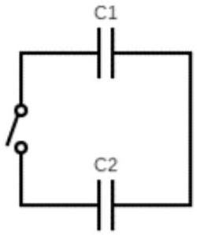

## Qu 1. General Questions

(a) . An aircraft is moving around the Earth at 900 km/h in clear daytime conditions. The pilot maintains a course of constant latitude and contrary to the Earth's rotation direction. Determine the latitude at which the pilot observes the Sun to remain in a fixed position in the sky. The equator is at zero latitude and the North pole at 90°.
(b) . A bucket of water is tipped out quickly from the top of a tall tower. It arrives at the ground as droplets in the form of rain. Give an explanation for this effect.
(c). Capacitor $C_{1}$ has a capacitance $6.0 \mu \mathrm{~F}$ and capacitor $C_{2}$ has a capacitance $12.0 \mu \mathrm{~F} . C_{1}$ is charged in a circuit with an emf of 12.0 V, whilst $C_{2}$ is initially charged with an emf of 6.0 V. The two capacitors are then put into a single loop circuit with an open switch, with the same polarities connected together. This is shown in Fig. 1. The switch is then closed, and an equilibrium state is reached.

Figure 1

    (i) What is the final pd across $C_{1}$ ?
    (ii) What fraction of the original energy stored in the capacitors has been dissipated as heat in the wires?
(d) . Three particles of equal mass $m$ are free to move under their mutual gravitational interactions. The particles occupy the same fixed circular orbit of radius $r$, and remain equally spaced throughout the motion. Calculate the orbital period of the system.
(e) . The current $I$ through a semiconductor thermistor is measured at a variety of temperatures. The current is given by $I \propto e^{-E_{g} / k_{\mathrm{B}} T}$ where $T$ is in kelvin, $k_{\mathrm{B}}$ is the Boltzmann constant, and $E_{g}$ is the band gap energy in the semiconductor. At $90^{\circ} \mathrm{C}$ the current is 10.90 mA and at $60^{\circ} \mathrm{C}$ it is 3.97 mA.
    (i) Find the value of $E_{g}$ (in eV)
    (ii) Find the current when $T$ is very large
