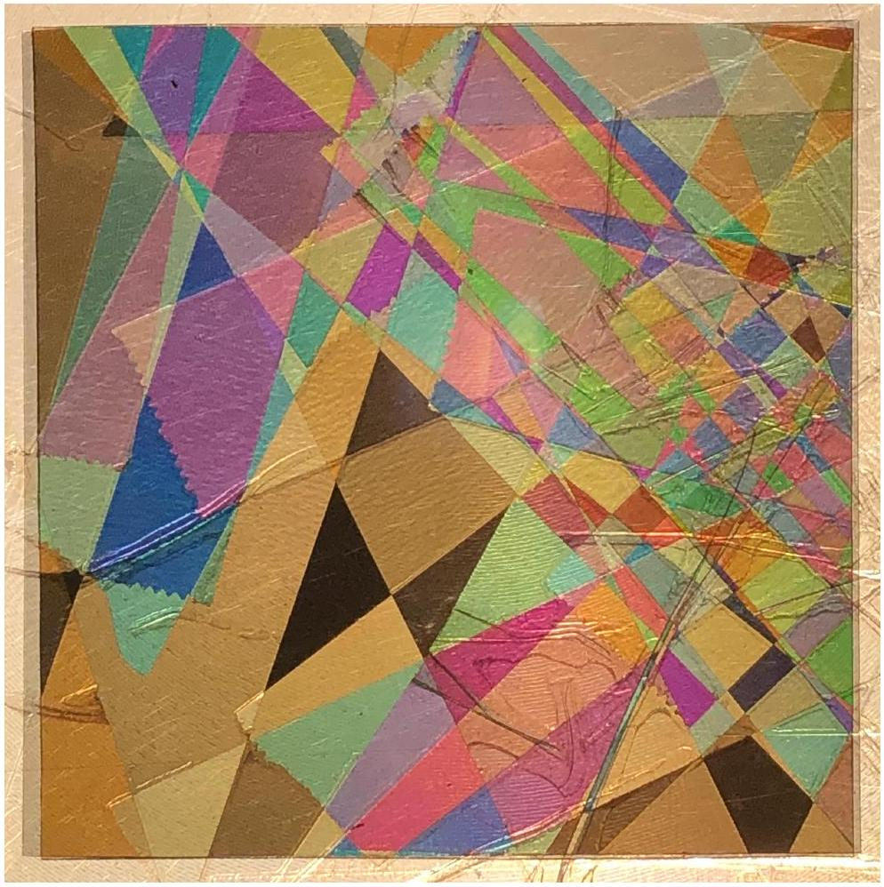
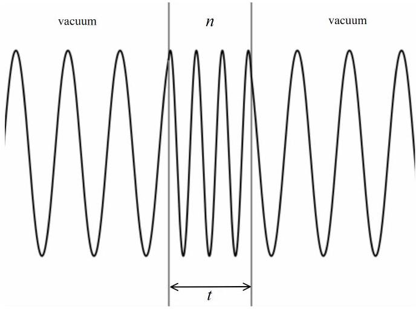
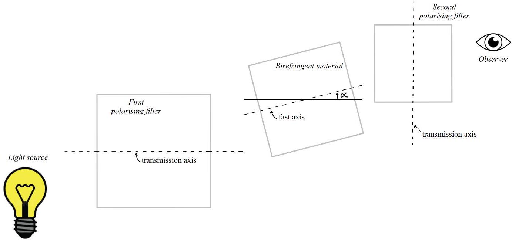
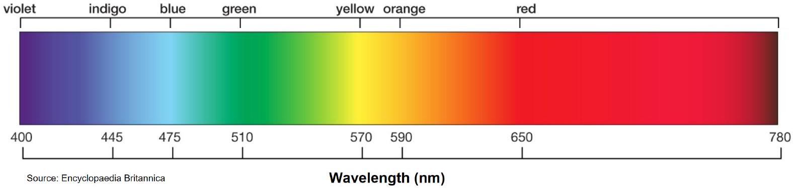

## Qu 3. Colourful transparent materials

This question explores the physics of the optical phenomenon demonstrated in Figure 5.

Figure 5: Sandwiched between two crossed polarisation filters, various strips of cellotape (sticky tape) have been set at random orientations, and are in places overlaying one another.

(a) Explain why any source of light appears black when viewed through polarisation filters that are crossed, i.e., when the transmission axes of the filters are mutually perpendicular.
(b)Consider a transparent material of thickness $t$ and refractive index $n$, shown schematically in Figure 6. If light of vacuum wavelength $\lambda$ strikes the material at normal incidence, argue that the number of wavelengths $M$ that occupy the material is

$$
M=\frac{t n}{\lambda} .
$$

Figure 6: Wavelength compresses when light enters an optically dense material from a vacuum.

Some optical materials display the property of birefringence. This means that the speed of propagation of light through the material depends upon the plane of polarisation of that light. Let $n_{f}$ denote the refractive index for light polarised along the 'fast' axis, and let $n_{s}$ denote the refractive index for light polarised along the 'slow' axis. These axes are mutually perpendicular and $n_{f}<n_{s}$.

(c) Assuming normal incidence, use Eq. 4 to show that the phase difference between the fast and slow waves, as they emerge from a birefringent material of thickness $t$, is given by
$$
\Delta \phi=\frac{2 \pi}{\lambda} t \Delta n,
$$
where $\Delta n=n_{s}-n_{f}$.

The quantity $\Delta n$ is known as the birefringence of the material, and for many materials is well-modelled as a constant value across the visible spectrum. Some examples are given in the Table 1.

| Material | Description | $\Delta n$ |
| :--- | :--- | :--- |
| Cellotape | Sticky tape | 0.0023 |
| Cellophane | Plastic wrap | 0.0110 |
| Calcite | Mineral | 0.1720 |

Table 1: Birefringence for various optical media. Source: https://arxiv.org/ftp/arxiv/papers/2206/2206.06983.pdf

The resulting phase difference $\Delta \phi$ between the fast and slow waves can be considered to effectively rotate the plane of polarisation of incident light, in a wavelength-dependent fashion. For incident unpolarised light of intensity $I_{0}$, uniformly distributed in wavelength, it can be shown that a birefringent material sandwiched between two crossed polarisers will transmit an intensity

$$
I=\frac{I_{0}}{2} \sin ^{2}(2 \alpha) \sin ^{2}\left(\frac{\Delta \phi}{2}\right),
$$

where $\Delta \phi$ is given by Eq. 5, and $\alpha$ is the angle between the fast axis of the birefringent material and the transmission axis of the first polarising filter. The experimental setup is shown schematically in Figure 7.

(d) State the angles $\alpha$ at which the fast axis of the birefringent material can be set to maximise the transmitted intensity, and explain why there is no transmission when the fast or slow axes are aligned with the transmission axis of the first polarising filter.

Figure 7: Schematic of experimental setup: a layer of birefringent material is sandwiched between two crossed polarising filters. The light source is viewed at normal incidence through this arrangement.

Figure 8: Visible wavelengths roughly span from 400 nm to 780nm.

(e) Consider two crossed polarising filters sandwiching a $30 \mu \mathrm{~m}$ layer of cellophane, with its fast axis set at $45^{\circ}$ to the transmission axes of the polarising filters. Making note of Figure 8 and Table 1, sketch the transmitted intensity across all visible wavelengths. Clearly label your sketch with the letter $E$ and suggest the apparent colour of such an arrangement.
(f) Now add to the same axes another sketch, labelled $F$, showing the transmitted intensity for a $90 \mu \mathrm{~m}$ sample of cellophane (again set at 45°). Suggest the apparent colour of such an arrangement.
(g) Suppose $10 \mu \mathrm{~m}$ of an unknown birefringent material is placed between crossed polarisers. The fast axis is not aligned with the transmission axes of the polarising filters. If the transmitted light is a stark green colour, with almost no blue or red, estimate the birefringence $\Delta n$ of this material.
(h) Reason why the transmitted light appears white when a very large thickness of birefringent material is used.
(i) With reference to their manufacture, suggest why polymers such as cellotape and cellophane display birefringent properties.
(j) Suggest, experimentally, how you could determine the thickness of a sample of cellophane.
(k) Consider a crystal of calcite placed between two crossed polarisers. Estimate the minimum number of atomic layers of calcite needed to observe colourful birefringent effects. Calcite has a density of $2.71 \mathrm{~g} \mathrm{~cm}^{-3}$ and a molar mass of $100 \mathrm{~g} \mathrm{~mol}^{-1}$.
