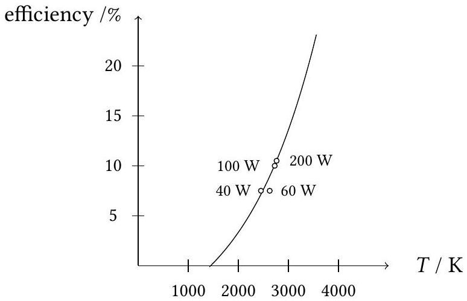

## Qu 4. Light Bulbs and Fluorescence

This question explores light bulbs and fluorescence.

(a) . A fluorescent material absorbs photons and re-emits photons of a longer wavelength. One of its most common applications is in fluorescent lamps, where a UV photon leads to the emission of a visible light photon.
    (i) Estimate the efficiency of a fluorescent light bulb. Why will this value necessarily be a maximum?

(ii) The graph below shows the estimated efficiency of incandescent light bulbs as the temperature of the filament varies. The estimation is based on a model where the filament is treated as a non-ideal black body emitting across the visible spectrum.

Figure 9: Estimated efficiency vs temperature $T$ of incandescent light bulbs. The open circles show data for 40, 60, 100, and 200 W bulbs.

Compare the efficiency of incandescent bulbs with fluorescent bulbs, commenting on your answer in light of the processes involved.

(b) . Electrical conductivity in semiconductors is determined by the susceptibility of electrons to be excited from the valence states ('valence band') to the conduction band ('conduction band'). The difference in energy between these two bands is called the band gap. In an LED, electrons in the conduction band fall to the valence band and emit photons in the process.
    (i) Gallium arsenide (GaAs) is a semiconductor with a band gap of 1.42 eV. Fluorescein is a liquid that absorbs light of a wavelength around 494 nm and fluoresces at around 512 nm. Determine whether a GaAs LED will stimulate fluorescence in fluorescein.
    (ii) A laser diode is made from a gallium arsenide-phosphide alloy $\left(\mathrm{GaAs}_{1-x} \mathrm{P}_{x}\right)$ with a band gap of $E_{g}=2.50 \mathrm{eV}$. This provides a collimated light source which is used to illuminate a dilute sample of fluorescein that absorbs a proportion $\varepsilon$ of the incident photons. The proportion of photons emitted (assumed isotropically) to photons absorbed by a fluorescent material is called its quantum yield, denoted by $\Phi$. A detector of area $A$ connected to a photomultiplier tube is situated at a distance $r$ from the sample, detecting emitted photons and generating a measurable electrical signal. The detector generates electrons via the photoelectric effect which are then amplified by a factor $f$ by the photomultiplier.
If the power of the laser is $P_{l}$, find an expression for rate of detection of of photons $\frac{\Delta n}{\Delta t}$, explaining your reasoning carefully. You may find that a diagram of the setup is helpful.
    (iii) In a particular experiment, the laser has a power of 4 mW , the dilution of fluorescein (whose quantum yield is 0.9 ) is $1 \%$, the detector diameter is 1 cm, and the signal is amplified by a

factor of $10^{6}$ to give a current of 3 mA . Calculate the distance between the sample and the detector. Why is this likely an overestimate?
(iv) If the uncertainty in the detector area diameter of ±5 \% dominates, estimate the uncertainty in the sample-detector distance.
(c) . Fluorescein is an example of a fluorophore, a chemical compound that can re-emit light upon excitation. The rate at which a population of $N$ excited fluorophores decays is proportional (with constant of proportionality $k$ ) to the number of excited fluorophores present. The fluorescence lifetime $\tau$ is the time taken for a population of $N$ excited fluorophores to decrease to $N / e$ via the loss of energy through fluorescing.
    (i) Find an expression for the number of excited fluorophores as a function of time after pulsed excitation, and determine the fluorescence lifetime. What are the units of $k$ and what are the units of $\tau$ ? Show your working and explain your reasoning.
    (ii) A short pulse of laser light is directed towards the sample in described in (b). Following this, the detector current changes from 3 mA to 0.25 mA in 10 ns . Calculate the lifetime of fluorescein.

END OF PAPER

Questions set by:
Lead: Rupert Allison, Giggleswick School, North Yorkshire
James Bedford, Harrow School
Alex Calverley, Surbiton High School
