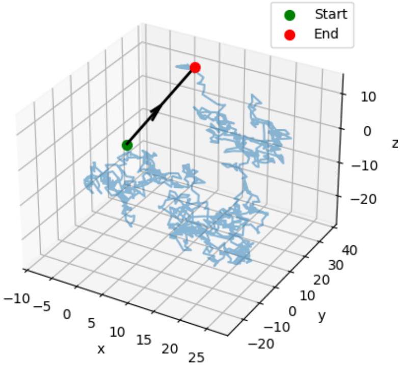
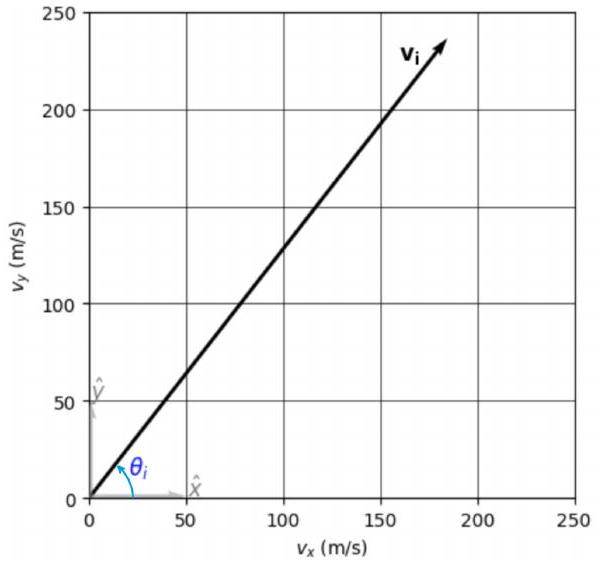

## Qu 2. Random walks

This question explores the motion of individual particles within a gas. This is an example of a random walk.

(a) Calculate the typical (root mean-square) speed of nitrogen molecules $\left(N_{2}\right)$ at room temperature. Assume that $N_{2}$ acts as an ideal gas. The molar mass of $\mathrm{N}_{2}$ is $28 \mathrm{~g} \mathrm{~mol}^{-1}$.
(b) Show that the density $\rho$ of any substance composed of $N$ particles occupying a total volume $V$ is given by
$$
\rho=\frac{M_{R} N}{N_{A} V},
$$
where $M_{R}$ is the molar mass and $N_{A}=6.022 \times 10^{23} \mathrm{~mol}^{-1}$ is Avogadro's constant. Hence, find an expression (in terms of density) for the average volume occupied by each particle.
(c) Under standard conditions, liquid nitrogen $\left(N_{2}\right)$ has a density of $807 \mathrm{~kg} \mathrm{~m}^{-3}$. Estimate (crudely) the diameter of a molecule of $\mathrm{N}_{2}$, stating any assumptions you make.

For an ideal gas of $N$ particles occupying a total volume $V$, the typical distance moved between collisions by molecules of diameter $d$ is known as the mean free path $\lambda$. This is given by:

$$
\lambda=\frac{V}{\sqrt{2} \pi d^{2} N} .
$$

We can also define the collision time $\Delta t$ as the typical time from one collision to the next.

(d) Determine $\Delta t$ for nitrogen molecules $\left(N_{2}\right)$ at room temperature and pressure $p=1.01 \times 10^{5}$ Pa.

Figure 2: The random walk of a gas molecule in three dimensions. Each collision randomises the direction of travel. The black vector indicates the final displacement of the molecule from its starting point after undergoing 1000 collisions.

With each collision the direction of travel of a given molecule is effectively randomised. As such, any individual molecule executes a random walk through the gas, an example of which is shown in Fig. 2.

For simplicity, consider gas molecules moving in two dimensions (2D) and make the approximation that the speed $v$ of any given molecule is constant in time. Moreover, assume that

Figure 3: An example of a velocity vector of a gas molecule moving in 2 dimensions. The unit vectors are not drawn to scale.

the time between collisions $\Delta t$ is constant from one collision to the next. Due to the exchange of momentum and the random nature of collisions, these assumptions are clearly false in detail. Nevertheless, they will yield instructive results.

(e) Suppose a given molecule undergoes $M$ collisions in a total time $t$. After collision $i$, its velocity vector $\mathbf{v}_{i}$ points at an angle $\theta_{i}$ measured anticlockwise from the positive $x$ axis, as shown in Fig. 3. Write down an expression for $\mathbf{v}_{i}$ in terms of $\theta_{i}$, the molecular speed $v$ and the conventional unit vectors $\hat{\mathbf{x}}, \hat{\mathbf{y}}$, which are aligned with the positive horizontal and vertical axes, respectively.
(f) Briefly explain why, after time $t$ and $M$ collisions, the vector displacement of the molecule $\mathbf{r}(t)$ is given by
$$
\mathbf{r}(t)=\sum_{i=1}^{M} \mathbf{v}_{i} \Delta t
$$
(g) With reference to your answer to (e), argue why on average the vector displacement is zero.
(h) By considering the average value of $\mathbf{r} \cdot \mathbf{r}$, determine an expression for the expected magnitude of the molecular displacement after $M$ collisions.
(i) Assuming the expression you have just derived also applies in three dimensions (3D), estimate the time taken for a nitrogen molecule to diffuse a distance of 5.00 m from its starting point. Assume room temperature and pressure $p=1.01 \times 10^{5} \mathrm{~Pa}$, and leave your answer in a sensible unit.
