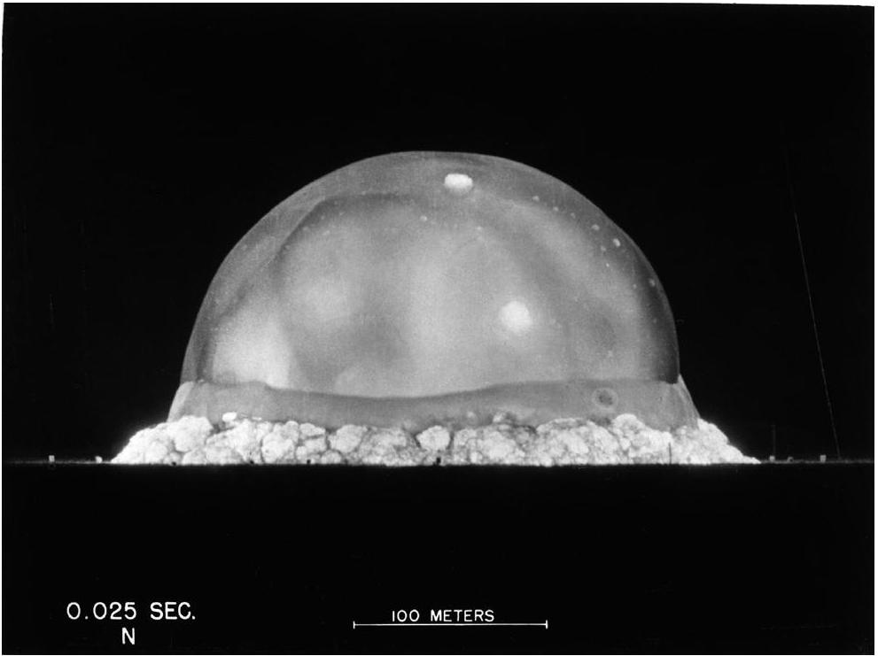

## Qu 3. The blast radius of The Gadget

This question is about the world's first atomic bomb test, which took place in New Mexico, USA, in 1945. The operation - part of the Manhattan Project - was code-named Trinity and the bomb itself was nicknamed The Gadget.

The radius $R$ of the shockwave from an atomic bomb depends upon the density of the atmosphere $\rho$, the time after the explosion $t$ and the energy $E$ released in the explosion.

(a) Using arguments of dimensional homogeneity (i.e., consistency of units), determine the values of the dimensionless unknowns $\alpha, \beta$ and $\gamma$ if
$$
R \propto \rho^{\alpha} t^{\beta} E^{\gamma} .
$$
It is reasonable to assume the dimensionless constant of proportionality $k$ implied in Eq. 5 is of order unity. Its precise value depends upon the circumstances of the explosion. Assume for the remainder of the question, and for simplicity, that $k=1$.
(b) Prove that the atmospheric density $\rho$ is given by
$$
\rho=\frac{M_{R} p}{R T},
$$
where $M_{R}$ is the (representative) molar mass of an air molecule. Show that, under typical sea-level conditions, $\rho \approx 1.3 \mathrm{~kg} \mathrm{~m}^{-3}$.
(c) The speed of sound $c_{s}$ is related to the ambient pressure $p$ and density $\rho$ by a simple formula:
$$
c_{s}=\sqrt{\frac{\gamma p}{\rho}},
$$
where $\gamma=1.40$ is the adiabatic index for air. Calculate the speed of sound under typical sea-level conditions.

Figure 4: The hemispherical shockwave 25 ms after detonation of The Gadget. Source:
https://www.atomicarchive.com/media/photographs/trinity/fireball-2.html. Accessed Dec 2024.

(d) Use information in Fig. 4 to show the the energy released by The Gadget was approximately 100 TJ.

(e) Calculate the radius of the shockwave generated by The Gadget after (i) 1 ms, (ii) 10 ms, and (iii) 0.1 s.
(f) Calculate the speed of the shockwave after (i) 1 ms, (ii) 10 ms, and (iii) 0.1 s.
(g) Eventually, the shockwave stalled due to dissipation of the shockwave energy to the surroundings. Briefly explain why energy dissipation increases dramatically when the shockwave speed drops below the speed of sound in the external atmosphere.
(h) Estimate the radius at which The Gadget's shockwave stalled and the corresponding time, after detonation, that this occurred.
(i) Following the test, scientists recorded structural damage to buildings at a distance of 3 km from the detonation site. Broken glass damage was observed as far as 30 km away. Reconcile these figures with your answer to part (h).
