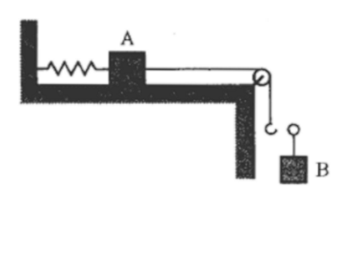

As shown in the figure, the left end of a light horizontal spring with a stiffness of $k = 40.0\ \mathrm{N/m}$ is attached to the wall, and the right end is attached to a small bar A of mass $M = 3.00\ \mathrm{kg}$. A thin weightless thread is tied to the right side of A and thrown over a light and smooth fixed block. A hook is attached to the other end of the thread. Bar A is located on a sufficiently long horizontal surface, and the coefficient of static friction between it and the bar is $\mu_0 = 0.200$, and the coefficient of sliding friction is $\mu = 0.180$. At the initial moment of time, the bar and the block are at rest, and the spring is not stretched. A load B of mass $m = 2.00\ \mathrm{kg}$ is hung on the hook and then released. Find the work to overcome the friction force $W_\mu$ and the time $t$ spent on the entire process of overcoming. Consider the free fall acceleration equal to $g = 10\ \mathrm{m/s^2}$.

