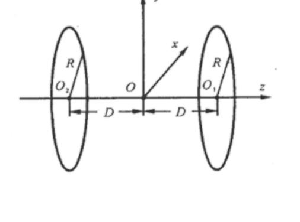

The figure shows two uniformly charged thin rings with radius $R$ and charge $Q$ ($Q > 0$). Their centers lie on the $Oz$ axis, their planes are perpendicular to it. The centers of the rings $O_1$ and $O_2$ are at the same distance $D$ from the center of coordinates $O$ lying between them. When solving the problem, gravity can be neglected. A charged particle of mass $m$ and charge $q$ ($q > 0$) moves along the positive direction of the $Oz$ axis from $z = -\infty$. It is known that its speed is enough to pass through the rings.

(a) Plot a characteristic plot of the kinetic energy $E_k$ of the particle as a function of the $z$ coordinate. Find for which $D$ different qualitative variants of the graph are realized.

(b) Describe the possible options for the motion of a particle released with a certain speed along the $Oz$ axis from the point $z = 0$.
