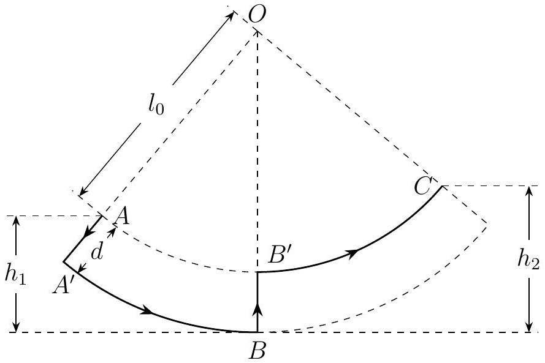

Problem 3 (35 points). Children who are well acquainted with the playground swing can force the seat to swing higher and higher by standing up and squatting at appropriate times. ${ }^{1}$ A boy of mass $m$ is playing with a swing whose seat and suspension rods (not chains) are light and rigid. We assume that all the boy's mass is concentrated at his centre of mass. When the boy stands, the distance between his centre of mass and the pivot of the swing is $l$, and when he squats, this distance is $l+d$. Realistically the boy should take a few moments to switch between the two postures, but we will ignore this. We model the situation as follows (see Figure 3.1 for an illustration): The boy squats instantaneously at point $A$, where he is momentarily at rest, from a standing position. Then he swings to point $B$, which is lower than $A$ by $h_{1}$, at which point he stands up (also instantaneously), such that his final radial speed is zero. Finally, the boy swings to point $C$, where he is again momentarily at rest. The process repeats in the opposite direction and so on, back and forth, such that the child swings higher with each successive swing. We assume that the force between the child and the seat is parallel to the suspension rods at all times. Take the gravitational potential energy to be zero at $B$.

Figure 3.1: A model of a boy on a swing. The solid lines indicate the trajectory of the boy's centre of mass.

(1) Assuming that no mechanical energy is lost as the boy maintains his posture, e.g. as he squats from $A^{\prime}$ to $B$ or stands from $B^{\prime}$ to $C$, find the boy's mechanical energy during each of the four stages of his motion, $A \rightarrow A^{\prime} \rightarrow B \rightarrow B^{\prime} \rightarrow C$. Find also the change in his mechanical energy from $A$ to $C$.
(2) We now attempt to model the mechanical energy loss even as the boy maintains his posture. We assume that the relationship between the energy loss $\Delta E$ and the absolute value of the change in height $\Delta h$ is given by
$$
\Delta E= \begin{cases}k_{1} m g\left(h_{0}+\Delta h\right) & \text { when the boy is squatting, and } \\ k_{2} m g\left(h_{0}^{\prime}+\Delta h\right) & \text { when the boy is standing, }\end{cases}
$$
where $0<k_{1}, k_{2}<1, h_{0}$, and $h_{0}^{\prime}$ are constants and $g$ is the gravitational acceleration. Taking the horizontal at $B$ as the ground, find

[^0]

(i)the relationship between $h_{n}$, the boy's distance from the ground when he becomes momentarily at rest for the $n$th time (counting point $A$ as the first time, as shown in Figure 3.1), and $h_{n+1}$, the distance for the $(n+1)$ th time; and
(ii)the relationship between $h_{n}$ and $h_{1}$ and between $h_{n+1}-h_{n}$ and $h_{1}$.
