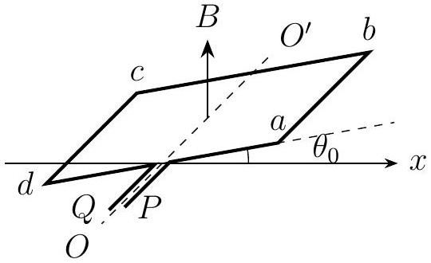

Problem 4 (35 points). Refer to Figure 4.1. A square wire loop $a b c d$ having uniform density, mass $m$, side length $l$, and resistance $R$ lies in a uniform magnetic field of magnitude $B$ which points vertically upwards. The loop can rotate freely about the axis $O O^{\prime}$, which passes through the midpoints of sides $a d$ and $b c$. The two ends of the loop are connected to the leads $P$ and $Q$. $O O^{\prime}$ and the $x$-axis are coplanar and orthogonal. We neglect the self-inductance of the wire loop.

Figure 4.1: A spinning wire loop.

(1) Find the moment of inertia $J$ of the wire about $O O^{\prime}$.
(2) When $t=0$, the wire is at rest and its plane makes a small angle $\theta_{0}$ with the $x$-axis. At this instant, we force a steady current $I$ through the wire in the direction given by $P \rightarrow a \rightarrow b \rightarrow c \rightarrow d \rightarrow Q$. Find the subsequent relationship between $\theta, \dot{\theta}$, and $\ddot{\theta}$, where $\theta$ is the angle between the the plane of the wire and the $x$-axis.
(3) When $t=t_{0}>0$, the wire reaches a horizontal position again, whereupon we disconnect the current source between leads $P$ and $Q$. Describe the subsequent motion of the wire. Hence, derive an expression for the potential difference $V_{P Q}$ between $P$ and $Q$.
(4) We allow the wire to undergo the above motion for a period of time. We short leads $P$ and $Q$ when the angle $\theta_{1}$ between the plane of the wire and the $x$-axis is somewhere within the range $\pi / 4 \leq \theta_{1} \leq 3 \pi / 4$. The wire will come to rest after rotating through an angle $\alpha$. Find the relationship between $\alpha$ and $\theta_{1}$. Find also the minimum value of $\alpha$.
