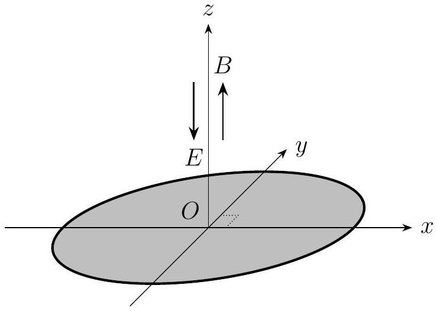

Problem 5 (35 points). Refer to Figure 5.1. A thin disc of radius $R$ is placed in the $x y$-plane such that its centre is at the origin $O$. The region above the $x y$-plane (i.e. $z>0$ ) is filled with a uniform electric field with magnitude $E$ pointing in the $-z$ direction, whereas the cylindrical region bounded by the $x y$-plane below and the cylinder with infinite length whose base is said disc (i.e. $z>0$ and $x^{2}+y^{2}<R^{2}$ ) is filled with a uniform magnetic field $B$ pointing in the $+z$ direction. The region outside this cylinder has zero magnetic field. Now suppose we fire particles carrying charge $q$, mass $m$, and speed $v$ from $O$ in all directions above the $x y$-plane in an isotropic manner (i.e. the probability of being fired in a certain direction is the same regardless of said direction). We ignore the effects of gravity and the interaction between the charges.

Figure 5.1: A disc suspended along the boundary of an electromagnetic field.

(1) Suppose that all collisions of the charges with the disc are elastic, and that $\eta=50 \%$ of the charges are constrained by the electric and magnetic fields to remain within the cylindrical region. Find the radius $R$ of the disc.
(2) We now introduce a model of non-elastic collisions. Suppose that, when a charge collides with the disc, the direction of the perpendicular component of its velocity is reversed, while that of the parallel component is unperturbed. Suppose further that the magnitudes of both components are reduced by the same proportion such that the kinetic energy of the charge is reduced by 10\%.
    (i) Consider the projection of the charge's location onto the $x y$-plane. Find the length of the path travelled by the projection during the period between the ejection of the charge and its first collision with the disc.
    (ii) Now consider the charge whose projection traverses the greatest distance as described in (i). Find the distance travelled by the particle from its ejection until it comes to rest on the disc.

We are given the integral

$$
\int \sqrt{1+u^{2}} d u=\frac{1}{2} u \sqrt{1+u^{2}}+\frac{1}{2} \ln \left(u+\sqrt{1+u^{2}}\right)+C
$$

where $C$ is a constant of integration.
