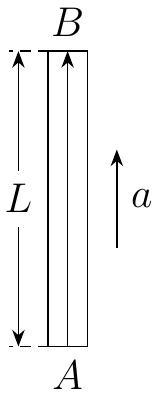

Problem 7 (35 points). (1) The equivalence principle, first elucidated by Albert Einstein in 1911, states that the laws of physics in a reference frame with gravity present are the same as those in some accelerating reference frame without gravity, provided that the acceleration is equal to a certain value. We study this principle by considering the following two examples.

(i) When a beam of light travels from a place of low gravitational potential to another place of a high gravitational potential, its wavelength increases. This phenomenon is known as gravitational redshift. Now consider a spherical body (say, a planet) with uniform density. Suppose that a beam of light with wavelength $\lambda_{0}$ is emitted vertically upwards from a point source $A$ near the surface of the planet. The light beam is detected by a fixed receiver $B$ vertically above $A$ such that $A B=L$. Find the wavelength $\lambda^{\prime}$ of the light detected by $B$. We are given the mass of the planet $M$, its radius $R$ (where $R \gg L$ ), the speed of light $c$, and the gravitational constant $G$. We may assume the weak field approximation applies, i.e. we may freely use the results of the Newtonian theory of gravity.
(ii) Refer to Figure 7.1. Suppose that a box whose length is $L$ is suspended in free space. A laser source $A$ and a receiver $B$ are fixed at the lower and upper ends of the box respectively. When time $t=0$, the box begins to accelerate from rest with magnitude $a$ along the direction of $\overrightarrow{A B}$, where $a L \ll c^{2}$. Simultaneously, a laser beam of wavelength $\lambda_{0}$ is emitted from $A$. Using the results of special relativity, find the wavelength $\lambda^{\prime \prime}$ of the light received at $B$.

Figure 7.1: A gravity-independent demonstration of gravitational redshift.

(iii) Compare the results of (i) and (ii). How large should $a$ be, in order for us to have $\lambda^{\prime}=\lambda^{\prime \prime}$ ?

(2) Gravitational redshift was first observed by Mössbauer spectroscopy near the Earth's surface, since the Mössbauer spectrometer allows physicists to determine the energy of gamma ray photons to a high precision. The setup is as follows: As in (1)(i), we place a fixed gamma ray source whose frequency is $\nu_{0}$ at a point $A$ near Earth's surface. We place a Mössbauer spectrometer at point $B$. We now make the following key assumption: that the spectrometer can only detect photons with frequency $\nu_{0}$ as measured in the reference frame where it is at rest. In order for the emitted photons to be detectable, the spectrometer must maintain a downward velocity. This experiment was conducted multiple times in a tower of the Jefferson Physical Laboratory at Harvard University by a team led by R. Pound, G. Rebka, and J. Snider from 1960 to 1964, in which $L=22.6 \mathrm{~m}$. Find the speed of the spectrometer at the instant when the photons from $A$ were detected.
We are given the gravitational acceleration $g=9.80 \mathrm{~m} \mathrm{~s}^{-2}$ and the speed of light in vacuum $c=3.00 \times 10^{8} \mathrm{~m} \mathrm{~s}^{-1}$.
