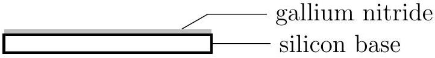
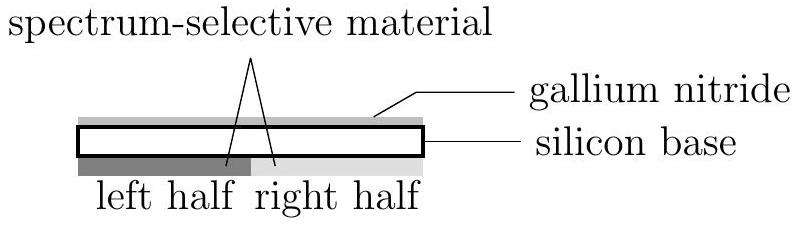
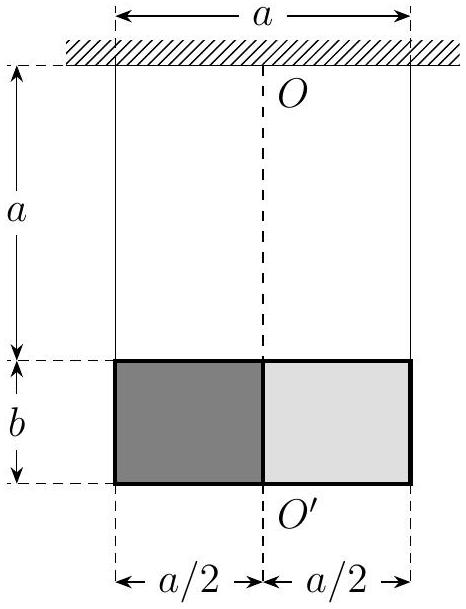

Problem 8. A sample of gallium nitride on silicon (GaN/Si) was prepared by depositing a thin layer of gallium nitride uniformly on a silicon wafer, as shown in Figure 8.1.

Figure 8.1: A wafer of GaN/Si.

(1) When a beam of light with wavelengths in the range 400 nm-1200 nm is orthogonally incident upon the GaN/Si wafer, and the reflected light measured, we observe that two particular wavelengths are amplified by thin-film interference, one of which is 600 nm. The relationship between the refractive index $n$ of the GaN and the wavelength $\lambda$ of incident light from a vacuum, i.e. the dispersion relation, is given by
$$
n^{2}=2.26^{2}+\frac{330.1^{2}}{\lambda^{2}-265.7^{2}},
$$
whereas the refractive index of silicon is within the range 3.49-5.49. By considering reflection at the GaN surface and the GaN/Si interface, determine the thickness of the GaN layer and the value of the second amplified wavelength.
(2)On the other side of the wafer, two kinds of spectrum-selective materials are coated uniformly on each half of the wafer, as shown in Figure 8.2. For light whose wavelength is a certain value, the coating on the left half is completely absorbent, while that on the right half is completely reflective.

Figure 8.2: A coated GaN/Si wafer.

As shown in Figure 8.3, we suspend the wafer from a fixed support with two strings whose lengths are both $a$ such that the strings are vertical. The wafer has length $a$ and width $b$, and is allowed to rotate about the axis $O O^{\prime}$, which causes it to move up and down simultaneously. The wafer is

Figure 8.3: A schematic of the suspended wafer.

initially at rest. We shine a strong laser beam whose wavelength has the aforementioned property on the spectrum-sensitive coating such that the light is orthogonally incident upon and uniformly distributed over the surface of the wafer, and wait until the wafer has rotated about $O O^{\prime}$ to a position where it is stationary again. The direction of the beam remains unchanged throughout the process. The coating is illuminated at all times. We neglect the effects of the radiation on the thin edges of the wafer.

We are given the thickness $d^{\prime}$ and density $\rho^{\prime}$ of the silicon wafer, the thickness $d$ and density $\rho$ of the GaN layer, and neglect the mass of the coating. We are also given the vacuum permittivity $\varepsilon_{0}$ and the gravitational acceleration $g$. Find the rms value $E$ of the electric field associated with the laser such that the wafer rotates through a given angle $\alpha$.

(3) Taking the values $E=5.00 \times 10^{4} \mathrm{Vm}^{-1}, d^{\prime}=3.00 \times 10^{-4} \mathrm{~m}, \rho^{\prime}=2.33 \times 10^{3} \mathrm{~kg} \mathrm{~m}^{-3}, \rho=$ $6.10 \times 10^{3} \mathrm{~kg} \mathrm{~m}^{-3}, \varepsilon_{0}=8.85 \times 10^{-12} \mathrm{~F} \mathrm{~m}^{-1}$, and $g=9.80 \mathrm{~m} \mathrm{~s}^{-2}$, determine the value of $\alpha$.

[^0]:    ${ }^{1}$ Translator's note. It was common for Chinese children (and perhaps, even now, daring mad lads both in China and elsewhere) to stand, rather than sit, on the seats of playground swings. Due to sanitary and safety concerns, we are not recommending that you try this at your local playground.
