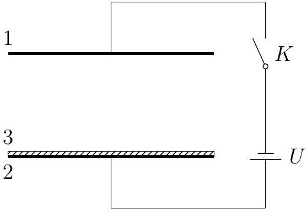

Problem 2 (35 points). Both plates (1 and 2) of a parallel-plate capacitor have area $S$, are fixed horizontally with separation $d$, and are connected to the circuit shown in Figure 2.1, where $U$ is the emf generated by the power source. An uncharged conducting plate (3) of mass $m$ and having the same dimensions as plates 1 and 2 is placed atop plate 2 and contacts it well. The whole setup is placed inside a vacuum chamber with vacuum permittivity $\varepsilon_{0}$. When the switch $K$ is closed, plate 3 colliides with plates 1 and 2 in an alternating fashion and undergoes reciprocating motion. We make the following assumptions: the electric field between 1 and 2 is uniform; the resistance of the wires and the internal resistance of the cell are small, so the characteristic charging and discharging times can be neglected; when plate 3 makes contact with plates 1 or 2, the free charge within the contacting plates reaches equilibrium instantly; and all collisions are inelastic. The gravitational acceleration is $g$.

Figure 2.1: A bouncing metal plate.

(1) ( 17 points). Find the minimum possible value of $U$.
(2) ( 18 points). Find the period of the reciprocating motion plate 3 is undergoing.

Note. The integral

$$
\int \frac{d x}{\sqrt{a x^{2}+b x}}=\frac{1}{\sqrt{a}} \ln \left(2 a x+b+2 \sqrt{a} \sqrt{a x^{2}+b x}\right)+C
$$

is given, where $a>0$ and $C$ is a constant of integration.
