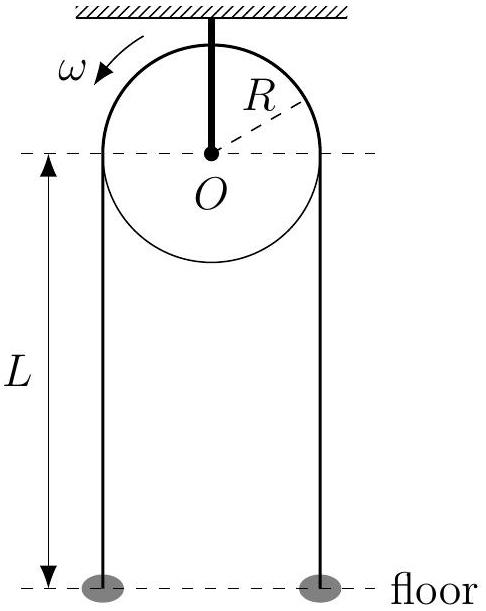

Problem 3 (35 points). Refer to Figure 3.1. An inextensible, massive string of uniform linear density $\lambda$ is threaded through a disc-shaped, fixed pulley of radius $R$, whose axle is a distance $L$ from the floor. The system is initially at rest. When $t=0$, the pulley acquires a constant angular speed $\omega$ (which is maintained throughout) in the anticlockwise direction and causes the string to move as well. The coefficient of kinetic friction between the pulley and the string is $\mu$. The suspended parts of the string are vertical throughout the motion, the ends of the string never leave the floor, and the piles of string resting on the floor are concentrated at two points. We are given the gravitational acceleration $g$. Denote the tension at the points on the left and right hand sides of the pulley, where the pulley is tangent to the string, by $T_{1}$ and $T_{2}$ respectively.

Figure 3.1: A massive string threaded through a rotating pulley. The grey blobs indicate piles of string.

(1) (20 points). Obtain a system of dynamical equations for any short length of string at all possible locations on the string. Consider two cases: the suspended parts and the part threaded through the pulley.
(2) (15 points). Find the maximum possible speed of the string.

Note. The identities

$$
\begin{aligned}
\frac{d y}{d x}+\alpha y & =e^{-\alpha x} \frac{d\left(y e^{\alpha x}\right)}{d x}, \\
\int e^{\alpha x} \cos x d x & =\frac{e^{\alpha x}}{1+\alpha^{2}}(\alpha \cos x+\sin x)+C_{1}, \quad \text { and } \\
\int e^{\alpha x} \sin x d x & =\frac{e^{\alpha x}}{1+\alpha^{2}}(\alpha \sin x+\cos x)+C_{2}
\end{aligned}
$$

are given, where $C_{1}$ and $C_{2}$ are constants of integration.
