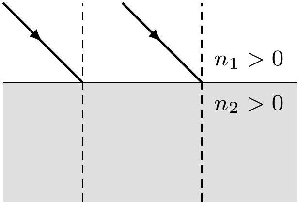
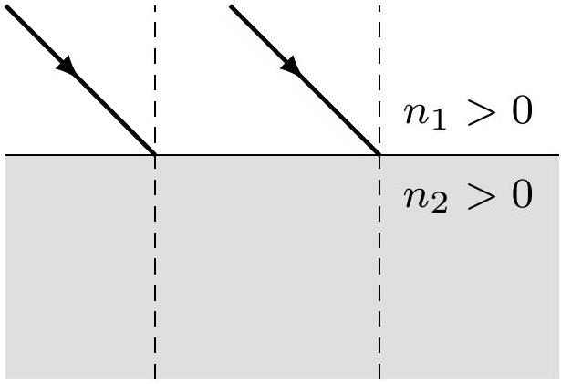
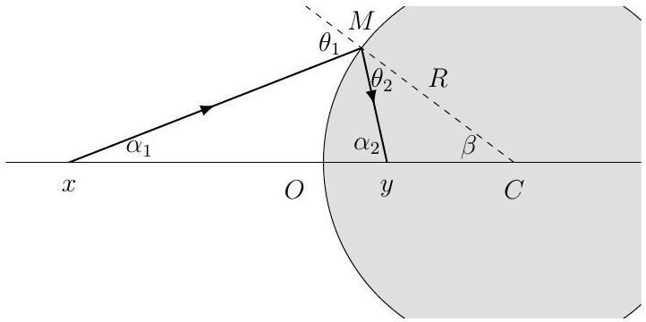

Problem 6 (35 marks). The refractive index $n$ of an optical medium can either be greater than or less than zero. Media in which $n<0$ are called negative-index meta-materials (NIMs). When light propagates in a NIM, its optical path length is negative. ${ }^{1}$ If we say that the angle of refraction is negative when the incident ray and refracted ray are on the same side of the normal, Snell's law

$$
n_{1} \sin \theta_{1}=n_{2} \sin \theta_{2}
$$

would still hold, even if the refractive index on either side were negative. Here, $n_{1}$ and $n_{2}$ can either be positive or negative, and $\theta_{2}$ is the angle of refraction. We use the convention where $\theta_{1} \geq 0$ always.

(1)(10 marks). Suppose that a beam of light is incident upon an interface between two materials with different refractive indices. For each possible case as depicted in Figures 6.1 and 6.2, show the path of the rays entering material 2 and the corresponding wavelets on the figures. Hence, show that the generalised Snell's law holds.

Figure 6.1

Figure 6.2

(2) (13 points). Refer to Figure 6.3. A spherical surface of radius $R$ and centre $C$ partitions threedimensional space into an outer region and an inner region, with refractive indices $n_{1}>0$ and $n_{2}<0$ respectively. Considering any optical axis passing through $C$, we set the origin at $O$, the intersection of the axis with the interface. Light ray $x$ is incident upon the interface at $M$ and refracts to give ray $y$, as shown. Let $s_{1}$ and $s_{2}$ be the object distance and image distance respectively. Under the paraxial approximation, derive the equivalent lens equation (a relationship between $s_{1}, s_{2}$, and the given parameters of the system) and an expression for the horizontal magnification of an image. Note down the sign of each quantity in the final results explicitly.

Figure 6.3: A spherical NIM.

(3) (12 points). Suppose that medium 1 is air, i.e. $n_{1} \approx 1$, and $n_{2}$ can either take positive or negative values. We place a thin convex lens of focal length $f=1.5 R$ in front of the spherical interface such that its optical axis passes through $C$, one focal point is inside the NIM, and the distance between $O$ and the centre of the lens $O^{\prime}$ is $d$. A beam of light rays all parallel to the axis is incident upon the lens. For each set of parameters in Table 6.1, obtain the distance between $O$ and the point at which all light rays converge. Also draw a figure illustrating the path of the light rays in case 4.

| Case | $n_{2}$ | $d$ |
| :--- | :--- | :--- |
| 1 | 1.5 | $0.35 R$ |
| 2 | 1.5 | $0.85 R$ |
| 3 | -1.5 | $0.35 R$ |
| 4 | -1.5 | $0.85 R$ |

Table 6.1
