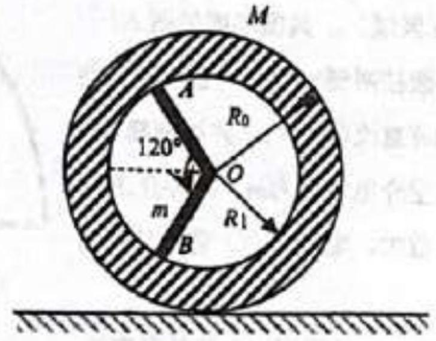

Problem 1 (40 points). A new car model must pass destructive testing before it can be approved for sale. In one particular test, a three-spoked wheel has one of its spokes knocked out. Its vertical cross section is shown in Figure 1.1. The wheel can be modelled as a combination of an annular lamina and two identical rods, all of which have uniform density. The lamina has an outer radius of $R_{0}$ and an inner radius of $R_{1}=\frac{4}{5} R_{0}$. The mass of each rod is $m$ and the mass of the lamina is $M=8 m$. The wheel is released from rest from the position shown in the figure, after which it rolls without slipping. Find

Figure 1.1: A broken wheel.

(1) the initial angular acceleration $\alpha_{0}$ of the wheel; and
(2) the angular acceleration $\alpha$ of the wheel, the normal force $F_{N}$, and friction $F_{f}$ acting on the wheel by the ground, when the spoke $O B$ first reaches a vertical position.
