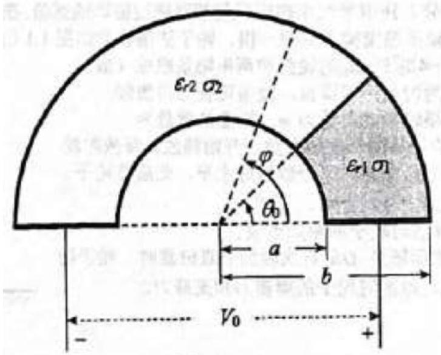
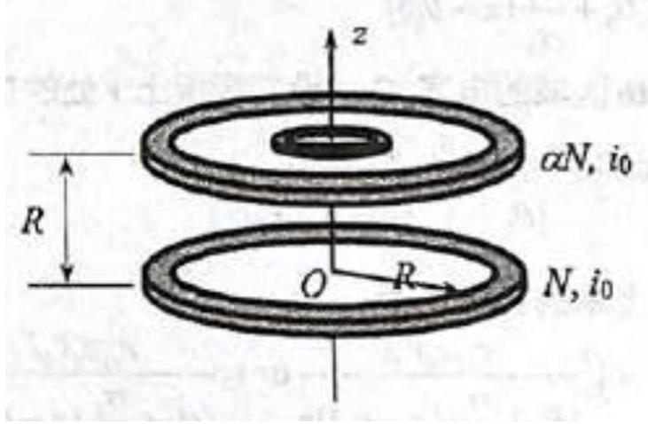

Problem 2 (40 points). Consider a cylinder-like solid whose base is described by a half-annulus of inner radius $a$ and outer radius $b$. The solid is composed of two leaky dielectrics ${ }^{1}$, with parameters $\epsilon_{r 1}$ and $\sigma_{1}$ for the region $0 \leq \varphi<\theta_{0}$ and parameters $\epsilon_{r 2}$ and $\sigma_{2}$ for the region $\theta_{0}<\varphi \leq \pi$, as shown in Figure 2.1. Now we coat each flat rectangular face of the solid with a metallic film, apply a steady potential $V_{0}$ between the two conductors (see figure for polarity), and wait until the system reaches a steady state. We are given the vaccum permittivity $\epsilon_{0}$, that $\epsilon_{r 1}$ and $\epsilon_{r 2}$ are large, and that $\sigma_{1}$ and $\sigma_{2}$ are small. Neglect any fringe effects. Take $V=0$ on the left metallic film.

Figure 2.1: A leaky dielectric.

(1) Find the magnitude of the electric field $E$ and the electric potential $V$ everywhere within the dielectric.
(2) Find the total accumulated charge $Q$ at $\varphi=\theta_{0}$.
(3) Obtain the resistance and capacitance across the regions $0 \leq \varphi<\theta_{0}\left(R_{1}, C_{1}\right)$ and $\theta_{0}<\varphi \leq \pi$ $\left(R_{2}, C_{2}\right)$.
(4) Suppose we disconnect the potential source at time $t=0$. In order to model the subsequent behaviour, we can design a circuit based on the given parameters of the solid. Draw this circuit. Hence, find the time dependence $V(t)$ of the potential difference between the metal films on each end.
[^0]Problem 3 (40 points). We investigate the applications of the superconducting gravimeter in this problem. The superconducting gravimeter can be used to obtain information about the Earth's interior such as mantle dynamics, distribution of mass, crustal tides, groundwater, and distribution of minerals. It can also be used to monitor external phenomena such as the coastal tides and climate change. These data can be obtained through long-term, high-precision measurements of minute changes in the local gravitational acceleration using the superconducting gravimeter. The superconducting gravimeter is extremely sensitive (with an uncertainty of around $10^{-9} g$ ) and has good measurement stability, and is thus the primary instrument of Earth scientists wishing to measure the local gravitational acceleration accurately. New opportunities arise for the the development of Earth sciences and precision measurements of the gravitational force, as more superconducting gravimeters and communication networks are built around the world. The following questions concern the effects of ground water on the local gravitational acceleration and the operating principles of the superconducting gravimeter.

1. We model the Earth as a uniform solid sphere of radius 6370 km, whose gravitational acceleration is $g_{0}=9.80 \mathrm{~m} \mathrm{~s}^{-2}$. Suppose that a spherical underground lake of diameter 20 km whose centre is 15 km from the surface. Find the difference in gravitational acceleration $\Delta g=g^{\prime}-g_{0}$ on the surface, vertically above the centre of the lake, given the values of the gravitational constant $G=6.67 \times 10^{-11} \mathrm{Nm}^{2} \mathrm{~kg}^{-2}$ and the density of water $\rho_{\mathrm{w}}=1.0 \times 10^{3} \mathrm{~kg} \mathrm{~m}^{-3}$. Neglect the effects due to Earth's rotation.
2. The main component of the superconducting gravimeter is a spherical shell made of a cooled, superconducting niobium alloy, suspended in a magnetic field. For convenience, we model the shell as a superconducting ring (see Figure 3.1). The external magnetic field is supplied by a superconducting Helmholtz coil-like device, composed of an upper coil with turn number $\alpha N$ and a lower coil with turn number $N$, where $\alpha<1$. The coils share the same radius $R$ and axis of symmetry, are separated by $R$, and are connected in series to an external power source. Before a measurement begins, the currents in the Helmholtz coil and the ring are zero, the ring is in the same plane as the lower coil $(z=0)$, and it shares the same axis of symmetry with both coils. When a measurement is made, the power source slowly introduces a current $i_{0}$ to the Helmholtz coil, which induces a current in the ring. If we adjust the magnitude of $i_{0}$, we can make the ring levitate such that it rests in the same plane as the upper coil $(z=R)$, as shown in Figure 3.1. As both the coil and the ring are superconductors (at a temperature of 4.2K), steady currents can be maintained in both conductors, even if the power source is switched off.

Figure 3.1: A model of the superconducting gravimeter.

We are given the mass of the ring $m$, its diameter $D=2 R$ (where $D \ll 2 R$ ), and its self-inductance $L$; and that the radial and vertical components of the magnetic field generated by the Helmholtz

coil can be expressed as

$$
\left\{\begin{array}{l}
B_{z}=B_{0}[1-\beta(z-R)], \\
B_{r}=\frac{1}{2} \beta B_{0} r,
\end{array}\right.
$$

where $B_{0}$ is the magnetic flux density at the centre of the upper coil, $\beta$ is the radial coefficient, and $r$ is the distance to the $z$-axis. Express

(1) $B_{0}$ and $\beta$;
(2) the induced current $I_{0}$ in the ring when it is in equilibrium at $z=R$; and
(3) the local gravitational acceleration $g$

in terms of the given parameters of the coil and the ring, and the current $i_{0}$ in the coil.
