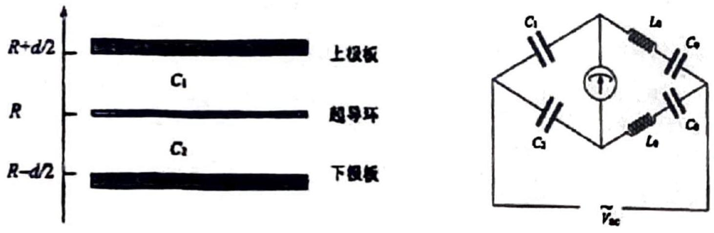

3. We consider the gravimeter after the power source has been removed. In order to obtain precise measurements of the minute changes in the local gravitational acceleration, an ac bridge circuit is used in the construction of the superconducting gravimeter. To understand its operating principle and simplify the calculations involved, we make a number of approximations. We model the ring as a thin conducting plate of area $A$, and fix two aluminium plates, each also of area $A$, above and below the ring in a symmetrical manner (i.e. the plates are located at positions $z=R+\frac{d}{2}$ and $\left.z=R-\frac{d}{2}\right)$. The three plates combined can be modelled as two capacitors, one $\left(C_{1}\right)$ composed of the upper plate and the superconductor, and another $\left(C_{2}\right)$ composed of the lower plate and the superconductor, as shown in Figure 3.2. We then connect $C_{1}$ and $C_{2}$ to two inductors $L_{0}$ and capacitors $C_{0}$ to form a bridge circuit, and then connect it to an a.c. power source (whose frequency is far greater than the rate of change of the local gravitational acceleration), as shown in Figure 3.3. Suppose that at some instant, the local gravitational acceleration is $g$, the ring is at $z=R$, and the bridge circuit is balanced. At this instant, we apply an additional steady voltage $V_{\mathrm{C}}$ across each capacitor $C_{1}$ and $C_{2}$. When the gravitational acceleration changes by $\Delta g$, the bridge circuit becomes unbalanced. If we increase the voltage across $C_{1}$ by $\Delta V$ and decrease the voltage across $C_{2}$ by $\Delta V$, the bridge circuit becomes balanced again.
Find the relationship between $\Delta g$ and $\Delta V$. Neglect all fringe effects.

Figure 3.2: The simplified model. Translation Figure 3.3: The external circuit. $C_{1}$ and $C_{2}$ (from top to bottom): upper plate, ring, lower on the left, $L_{0}$ and $C_{0}$ on the right, $\tilde{V}_{\text {ac }}$ at the plate. bottom.
