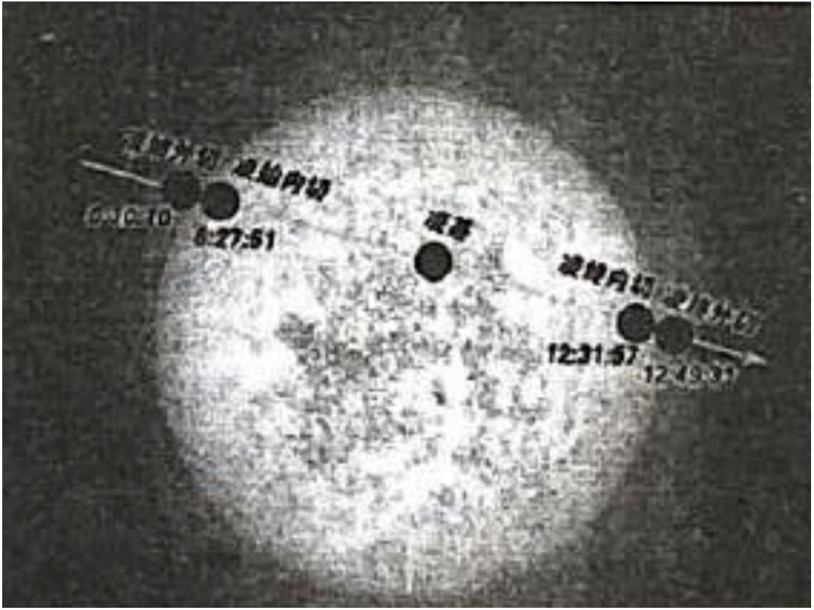
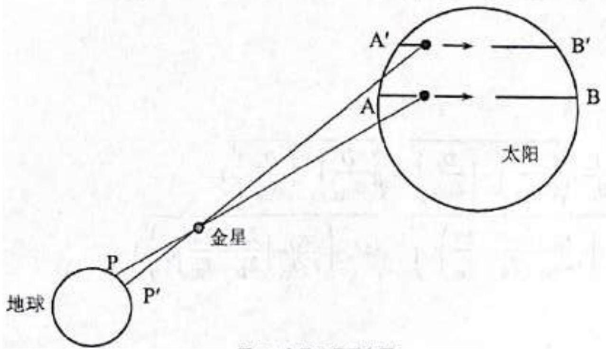
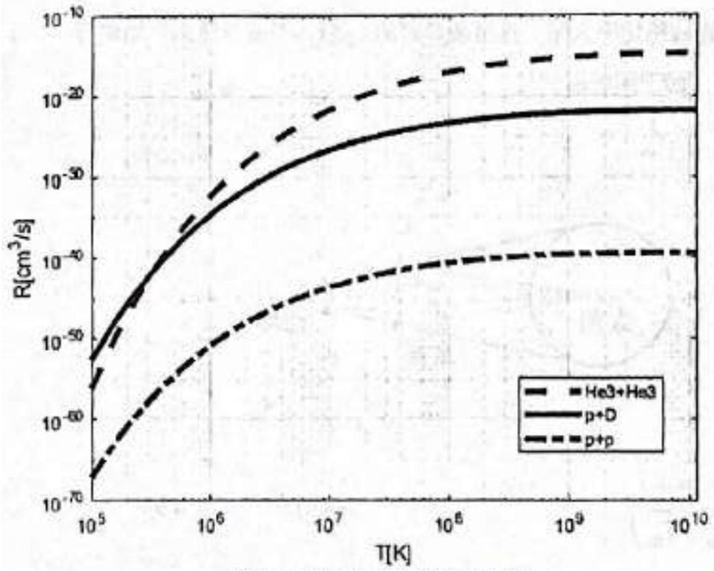

Problem 6 (80 points). The starry night has inflamed human imaginations for much of our history. As science and technology make progress over the years, human knowledge about the cosmos has expanded substantially, especially in light of the new insights of the $21^{\text {st }}$ century, such as the resolution of the missing neutrino problem, direct observation of gravitational waves, and the first image of a black hole. These events have inspired interest among members of the public. How can humanity explain cosmic and stellar phenomena, when our means are limited by the size and nature of our apparatus? Can the public, whose knowledge is limited to the high school level, quantitatively understand both the internal and external features of stars, such as their size, their mass, their life cycle, their structure, and their mechanisms of power generation? This problem, in constructing a model of the Sun, progresses from simple to complex models and follows the arc of history. As we cannot directly observe the Sun's interior, the models we consider must be tested by a manifold of observations, such as the Sun's age, its radius, its surface temperature, its power output, and its emission of neutrinos. All these observations must conspire to produce an internally-consistent model.

The following parameters are given: the radius of the Earth is 6370 km, the gravitational constant $G=6.67 \times 10^{-11} \mathrm{~N} \mathrm{~m}^{2} \mathrm{~kg}^{-2}$, the Stefan-Boltzmann constant $\sigma=5.67 \times 10^{-8} \mathrm{~W} \mathrm{~m}^{-2} \mathrm{~K}^{-4}$, the Boltzmann constant $k_{B}=1.38 \times 10^{-23} \mathrm{JK}^{-1}$, the elementary charge $e=1.602 \times 10^{-19} \mathrm{C}$, the electron mass $m_{\mathrm{e}}=0.51 \mathrm{MeV} / c^{2}$, the proton mass $m_{\mathrm{p}}=938.3 \mathrm{MeV} / c^{2}$, the deuteron mass $m_{\mathrm{D}}=1875.6 \mathrm{MeV} / c^{2}$, the ${ }^{3} \mathrm{He}$ mass $m_{{ }^{3} \mathrm{He}}=2808.4 \mathrm{MeV} / c^{2}$, and the ${ }^{4} \mathrm{He}$ mass $m_{{ }^{4} \mathrm{He}}=3727.5 \mathrm{MeV} / c^{2}$.

1. A 2000-year-old Chinese classic text on arithmetic, the Zhoubi Suanjing, describes a method of measuring the ratio between the solar diameter $D$ and the distance between the Sun and Earth $S_{\text {S-E }}=1 \mathrm{AU}$. Take a long, straight bamboo rod and hollow out its interior such that the inner diameter is $d$. Line up the axis of the rod with the Sun and adjust its length such that the solar disc just 'fills up' the end of the rod opposite to the observer. ${ }^{2}$
    (1) Write down the relationship between the angular diameter of the solar disc $\Phi=D / S_{\odot \oplus}, d$, and $L$.
    (2) The rod should be long in order to minimise the experimental error. What other ways are there to further minimise the error?
    (3) We obtain the measurements $d=1$ inch and $L=8$ feet. ${ }^{3}$ Find the value of $\Phi$.
2. On rare occasions (such as on 6 June 2012), Earth, Venus, and the Sun nearly lie on the same line (i.e. are collinear). If we observe the Sun at these times, Venus appears as a small black spot moving slowly across the solar disc. This is known as a transit of Venus, and a schematic is shown in Figure 6.1. The British astronomer Edmond Halley once suggested in 1716 that the angular diameter and the distance between the Sun and the Earth could be measured by collecting data from observations of the transit of Venus around the world at the same time. We are given that Earth and Venus orbit the Sun in the same direction with periods $T_{\oplus}=365.256$ days and $T_{\bar{q}}=224.701$ days respectively, that the inclination between the two orbital planes is small, and that Earth's rotation can be neglected.
    (a) Suppose that both Earth and Venus orbit the Sun in circular orbits. Find the ratio $r_{\mathrm{VE}}$ of the Sun-Venus distance $S_{\odot \ell}$ to the Sun-Earth distance $S_{\odot \oplus}$.
[^1]
Figure 6.1: Transit of Venus on 6 June 2012. Translation (in order from left to right): Ingress, exterior, 6:10:10; Ingress, interior, 6:27:51; Greatest transit; Egress, interior, 12:31:57; Egress, exterior, 12:49:31.

(b) On 6 June 2012, the transit of Venus is observed somewhere on Earth, with the key phases of the transit marked on Figure 6.1. The shadow of Venus traces out a chord of the solar disc. Find the ratio between the length of this chord $D_{\mathrm{P}}$ and the Sun-Earth distance $S_{\odot \oplus}$. Find also the angular diameter $\Phi$ of the solar disc, given the distance $h_{\mathrm{P}}=5 D / 16$ of the chord from its centre.
(c) The measurement of the distance between the Sun and Earth requires observing the same transit at different locations on Earth, as shown in Figure 6.2. Suppose that two observers $P$ and $P^{\prime}$ located on the same line of longitude observe the transit simultaneously, separated by a distance $H$ measured along the Earth's surface. $P$ observes Venus tracing out a chord $A B$ on the solar disc and measures a transit time of $t_{P}$, while $P^{\prime}$ sees the chord $A^{\prime} B^{\prime}$ and measures $t_{P^{\prime}}$. Express $S_{\odot \oplus}$ in terms of $\Phi, r_{\mathrm{VE}}, T_{\oplus}, T_{\stackrel{\circ}{\boldsymbol{q}}}, t_{P}, t_{P^{\prime}}$, and $H$.
(d) We are given the latitudes of Beijing, 39.5°, and Hong Kong, 22.5°, and their corresponding measured transit times, $t_{P}=6: 21: 57$ and $t_{P^{\prime}}=6: 19: 31$. Use the given data and the result of (3) to obtain the numerical value of $S_{\odot \oplus}$.
3. The observations of the transit of Venus in 1882 yielded the results $S_{\odot \oplus}=1.5 \times 10^{8} \mathrm{~km}$ and $D=$ $1.4 \times 10^{6} \mathrm{~km}$. The Earth receives solar radiation of intensity $I=1.37 \mathrm{~kW} \mathrm{~m}^{-2}$, when measured in a plane perpendicular to the direction of radiation transfer. Obtain:
(1) the total solar energy received by the Earth per unit time;
(2) the ratio between the total energy consumption of all seven (7) billion people on Earth and the total solar energy, assuming that each person consumes the energy equivalent of three (3) metric tonnes of coal, and that 1 kg of coal produces 4 kWh of energy; ${ }^{4}$
(3) the total energy emitted by the Sun per unit time; and
(4) an estimate of the surface temperature of the Sun.
[^2]
Figure 6.2: A method measuring the Sun-Earth distance. Translation (left to right): Earth, Venus, Sun.

4. (1) Obtain the solar mass and the average solar density.
(2) If the energy emission of the Sun were caused by chemical processes, and assuming that the radiation emitted per unit mass were the same as the energy resulting from combustion of a unit mass of coal (see 3.2), for how long can the Sun continue to emit radiation in this manner?
The Sun has existed as a star for five (5) billion years. How many times is the rate of energy production compared with the rate in the case where all the solar energy were accounted for by chemical reactions?
5. We know that the Sun is mainly composed of hydrogen due to spectral analysis. The fusion reactions hydrogen can be involved in are given by

$$
\begin{aligned}
\mathrm{p}+\mathrm{p} & \longrightarrow \mathrm{D}+\mathrm{e}^{+}+\nu_{e} ; \\
\mathrm{D}+\mathrm{p} & \longrightarrow{ }^{3} \mathrm{He}+\gamma ; \\
{ }^{3} \mathrm{He}+{ }^{3} \mathrm{He} & \longrightarrow{ }^{4} \mathrm{He}+\mathrm{p}+\mathrm{p} .
\end{aligned}
$$

In the above reactions, the positrons will be annihilated, while the neutrinos will escape the Sun. The atomic nuclei are positively charged and repel each other, unless they are at a very high temperature, in which case their kinetic energy may be able to overcome the electrostatic repulsion between them, thereby undergoing a fusion reaction. When the temperature is high enough, all the atoms are ionised, become free nuclei and electrons, and form a plasma. In this section, we neglect the energy carried away by the neutrinos and the unreacted hydrogen carried away by the solar wind.

(1) How many protons are consumed per unit time to maintain the solar radiation?
(2) At present, 71\% of the Sun is composed of hydrogen. Assuming that the rate just obtained is maintained ever after, for how long can this consumption be maintained? Write down the probability per unit time $P_{\text {pp }}$ of a proton-proton reaction.
(3) The number of neutrinos escaping the Sun does not fall off during transmission from the Sun to the Earth. How many neutrinos pass through a unit area on Earth, measuring in a plane perpendicular to the neutrinos' direction of travel?

(4) How much mass is lost by the Sun per unit time due to radiation?
6. The probability $P$ of a fusion reaction is related to the plasma temperature $T$, and the probability also increases with the particle number density $n$. The relationship is given by $P=n R(T)$, where $R(T)$ is the rate of reaction. Figure 6.3 shows the relationship between the rate of reaction and the plasma temperature, for each of the three reactions given previously. The core is a spherical region whose boundary is concentric with the solar surface and whose radius is 1/4 the solar radius. Obtain an estimate for the lower limit of the solar core temperature.

Figure 6.3: A graph of the rate of reaction $R$ against the plasma temperature $T$.
7. Obtain an estimate of the maximum possible energy a single neutrino can carry away. Hence, obtain an estimate for the maximum relative error of the energy consumption estimate in 5.1, due to neglecting the neutrino energy loss.
8. We know from the previous tasks that the solar mass will decrease over time, which will affect the period and radius of Earth's orbit around the Sun. Obtain:
    (1) the mass loss $\Delta M$ to radiation over a period of one (1) billion years; and
    (2) the resulting change in Earth's orbital period.

[^0]:    ${ }^{1}$ A leaky dielectric is a dielectric which is not a perfect insulator. Such a material can be described by two parameters: its relative permittivity $\epsilon_{r}$ and its conductivity $\sigma$.

[^1]:    ${ }^{2}$ Warning. We are not advocating that you try this yourself. Following the given instructions may well result in blindness.
    ${ }^{3}$ Translator's note. The Chinese paper specifies the measurements in ancient Chinese inches and feet for the sake of historical accuracy. It is given there that 10 inches make a foot (not 12 inches).

[^2]:    ${ }^{4}$ Translator's note. This exercise was first done by Helmholtz in 1854, to demonstrate that the energy of the Sun could not be generated by chemical reactions.
