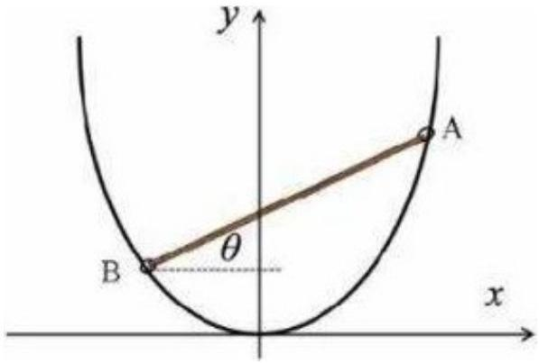

## Equilibrium - CPhO 2022

As shown in the figure, a section of a rigid metal wire of a parabolic shape is fixed in a vertical plane. By introducing a horizontal $x$-axis and a vertical $y$-axis, the shape of the wire can be described by the equation $y=a x^{2}$, where $a$ is an unknown constant. A rigid homogeneous rod $A B$ of length $2 l$ has small holes at its ends through which a wire is threaded, which allows the rod to slide along it without separation with negligible friction. It turned out that in the equilibrium position the rod is located at an angle $\theta=30^{\circ}$ to the horizon. The free fall acceleration is $g$.

1. Find the constant $a$.
2. Find the frequency $f$ of small oscillations of the rod about the equilibrium position.

Now let the rod be at rest in the equilibrium position, and a mouse (small enough to ignore its size) begins to climb up. It turned out that all the time the mouse was raised, the rod remained at rest.

1. Find the movement $s$ of the mouse over the rod in time $t$. Can a mouse climb to the top of the rod? If so, what is the minimum time $t_{\text {min }}$ for it to do this?
