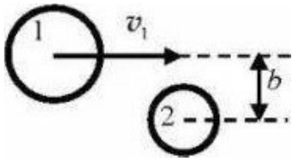

## Collision Challenge : CPhO 2022

Consider the simplest scattering process: particle 1 (incoming particle) with kinetic energy $K_{1}$ flies from infinity and collides elastically with particle 2 (target particle) at rest, as a result of which the kinetic energy and direction of motion of the first particle change.

Let the kinetic energy of the particle 1 after scattering be $K_{1}^{\prime}$. We introduce a kinematic factor $k=\frac{K_{1}^{\prime}}{K_{1}}$

1. In what range can the values of $k$ lie?

Let us denote as $\theta$ the angle between the directions of particle motion before and after scattering. Let us also introduce the value $R$ - the ratio of the mass of the second particle to the mass of the first. We fix some value of $R$ and look at the behavior of $k$ as a function of $\theta$.

2. Find $k(\theta)$ and specify the range of possible values of $\theta$ for an arbitrary fixed $R$. Consider separately the cases $R>1, R=1$ and $R<1$.

It turns out that in a certain range of values of $R$, the kinematic factor $k$ can be a multivalued function of $\theta$. To unambiguously determine the branch of the function $k(\theta)$, it is necessary to supplement the description of the interaction of particles. Let's try to do this on the example
of the simplest model, in which the colliding particles are considered as uniform smooth spherical solid bodies interacting only upon collision. Let the sum of particle radii be $A$ and the impact parameter be $b$ (see figure).

3. In this model, express $k$ in terms of $R, A$, and $b$. Select the branches of this function by considering particular cases of head-on ( $b=$ 0) and tangent $(b=A)$ collisions. Find what range of $b$ values corresponds to each of the obtained branches.

Now let the rest masses of both particles be equal to $m_{0}$, the particle sizes are insignificant, and the speed of the incident particle is so high that it becomes necessary to take into account relativistic effects. The speed of light in vacuum is $c$.

4. Find an expression for the kinematic factor $k(\theta)$. Compare it with the classical result.
5. How are $K_{1}^{\prime}$ and the angle $\alpha$ between the directions of particle motion after a collision related? For what $K_{1}^{\prime}$ does the function $\alpha\left(K_{1}^{\prime}\right)$ have an extremum? What is the extremum (minimum or maximum) and what is the extreme value of $\alpha$ ? What is $\theta$ equal to?
