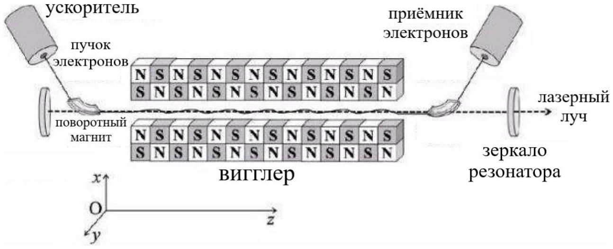
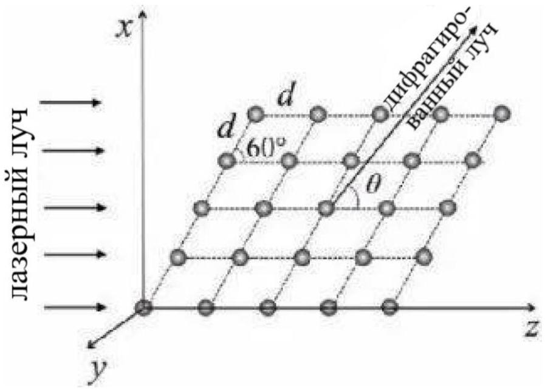

## Electron Laser - CPhO 2022

A free electron laser is a device that converts the energy of an electron beam into coherent radiation. This technology has great prospects in science, manufacturing and other fields. As shown in the figure below, a free electron laser consists of three main parts: an electron beam accelerator, a wiggler, and an optical cavity. The main part, the wiggler, consists of a series of permanent magnets, the orientation of which changes along the $z$ axis with a spatial period $\Lambda$. This allows you to create a constant inhomogeneous magnetic field along the $x$ axis,

$$
B=B_{0} \cos \frac{2 \pi z}{\Lambda} .
$$

The electron beam is accelerated in the accelerator to the speed $V_{0}$ and directed to the wiggler with the help of a rotating magnet. Under the action of the magnetic field of the wiggler, the electrons begin to make small oscillations along the $z$ axis, losing a small part of their energy to radiation. The rest mass of an electron is $m_{e}=9.11 \cdot 10^{-31} \mathrm{~kg}$, its charge is $-e, e=1.60 \cdot 10^{-19} \mathrm{C}$. Ignore the effect of gravity.

In addition to the laboratory reference frame $S(x, y, z)$, we introduce a reference frame $S^{\prime}\left(x^{\prime}, y^{\prime}, z^{\prime}\right)$, whose axes are parallel to the $S$ axes and which moves relative to it with the velocity $V_{0} \vec{e}_{z}$. At the moment the electron hits the wiggler $\left(t=t^{\prime}=0\right)$, the origins of the coordinates of both systems coincide.
Note: consider the law of transformation of the electromagnetic field as known when switching between reference systems $S$ and $S^{\prime}$ :

$$
\left\{\begin{array} { l }
{ E _ { x ^ { \prime } } = \frac { E _ { x } - v _ { 0 } B _ { y } } { \sqrt { 1 - [ \frac { v _ { 0 } } { c } ] ^ { 2 } } } } \\
{ E _ { y ^ { \prime } } = \frac { E _ { y } + v _ { 0 } B _ { x } } { \sqrt { 1 - [ \frac { v _ { 0 } } { c } ] ^ { 2 } } } } \\
{ E _ { z ^ { \prime } } = E _ { z } }
\end{array} \quad \left\{\begin{array}{l}
B_{x^{\prime}}=\frac{B_{x}+\frac{v_{0}}{c^{2}} E_{y}}{\sqrt{1-\left[\frac{v_{0}}{c}\right]^{2}}} \\
B_{y^{\prime}}=\frac{B_{y}-\frac{v_{0}}{c^{2}} E_{x}}{\sqrt{1-\left[\frac{v_{0}}{c}\right]^{2}}} \\
B_{z^{\prime}}=B_{z}
\end{array}\right.\right.
$$

where $c$ is the speed of light.

1. Find in the first approximation the law of electron motion $\left(x^{\prime}\left(t^{\prime}\right)\right.$, $\left.y^{\prime}\left(t^{\prime}\right), z^{\prime}\left(t^{\prime}\right)\right)$ in the reference frame $S^{\prime}$. Draw qualitatively the trajectory of an electron.
2. Find the accelerating voltage $U$ used to accelerate the electron beam if the spatial period of the wiggler structure is $\Lambda=1.00 \mathrm{~mm}$

and the wavelength of the $X$-ray radiation generated by the laser is $\lambda=4.00 \AA$.

Let now a plane $X$-ray wave with $\lambda=4.00 \AA$, obtained with the help of this laser, is incident in the $x z$ plane on a rhombic crystal. In this crystal, the distance between neighboring atoms is $d=8.00 \AA$, and the acute angle at the lattice vertices is 60°.

3. How many main diffraction maxima can be observed at infinity in the $x z$ plane? Find the position of each of them (determined by the angle $\theta$, as in the figure).
