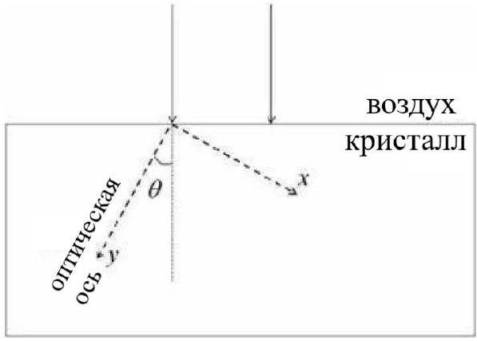

## Birefringence - CPhO 2022

There are crystals in which the propagation of light occurs anisotropically. In their simplest type - uniaxial crystals - the light is then divided into two waves: ordinary (index $o$; isotropic) and extraordinary (index $e$; anisotropic). Also, in uniaxial crystals, there is a distinguished direction - the optical axis of the crystal - during propagation along which the ordinary and extraordinary waves move with the same speed $v_{o}=\frac{c}{n_{o}}$, where $n_{o}$ is the refractive index of the ordinary wave. In this case, the extraordinary wave will move perpendicular to the optical axis with the speed $v_{e}=\frac{c}{n_{e}}$. If the direction of propagation of an extraordinary wave is arbitrary, its refractive index turns out to be a continuous function of the angle at which it moves relative to the optical axis.

It follows from the Huygens principle that the front of an extraordinary wave emitted by a point source is an ellipsoid of revolution, the symmetry axis of which is parallel to the optical axis of the crystal. Let's introduce a coordinate system, as shown in the figure, directing the $y$-axis along the optical axis. Let us consider the propagation of ordinary and extraordinary waves in the $x y$ plane.

1. Guided by the Huygens principle, describe a scheme that allows you to determine the direction of wave propagation in a uniaxial crystal.

Let a plane wave with a wavelength $\lambda$ normally fall on the surface of a crystal from air. The angle between the normal to the crystal surface and its optical axis is $\theta$.

2. Draw the wavefronts of the ordinary and extraordinary waves propagating in the crystal. Display their wave vectors $\vec{k}_{o}, \vec{k}_{e}$ (perpendicular to the fronts) and wave propagation directions $\vec{N}_{o}, \vec{N}_{e}$ respectively. For definiteness, consider that $n_{o}>n_{e}$.
3. Express the angle $\xi$ between the propagation direction $\vec{N}_{e}$ of the extraordinary wave and the optical axis of the crystal in terms of $n_{o}, n_{e}$ and $\theta$.

The dispersion of the refractive index in a uniaxial BBO crystal (barium $\beta$-borate) has the form:

$$
\left\{\begin{array}{l}
n_{o}^{2}(\lambda)=2.7359+\frac{0.01878}{\lambda^{2}-0.01822}-0.01354 \lambda^{2} \\
n_{e}^{2}(\lambda)=2.3753+\frac{0.01224}{\lambda^{2}-0.01667}-0.01516 \lambda^{2}
\end{array}\right.
$$

(Here, the wavelength $\lambda$ in vacuum is measured in $\mu \mathrm{m}$.)

1. Find $n_{o}$ and $n_{e}$ in the BBO crystal at vacuum wavelengths of 800.0 nm and 400.0 nm.

One of the key functions of anisotropic crystals is frequency doubling the transformation of two photons with the original frequency into one photon with doubled frequency. Such a process must satisfy the laws of conservation of energy and momentum. The photon momentum $\vec{p}$ and its wave vector $\vec{k}$ are related by $\vec{p}=\hbar \vec{k}$, where $\hbar$ is the reduced Planck constant.

2. How are the wave vectors of a photon before $\left(\vec{k}_{1}\right)$ and after $\left(\vec{k}_{2}\right)$ frequency doubling related?
3. Propose a way to satisfy the conservation laws when doubling the frequency in a BBO crystal. The wavelength of the light used in vacuum is 800 nm.
4. At what angle $\theta$ would it be possible to double the frequency of this light when passed through a BBO crystal?
5. What will be the angle $\alpha$ between the wave vector $\vec{k}_{e}$ of the extraordinary wave and the direction of its propagation $\vec{N}_{e}$ ?
