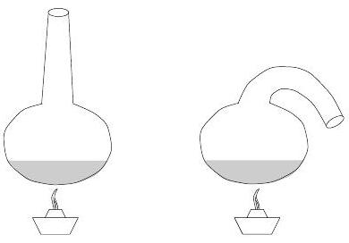

**2. Különböző alakú lombik.**

Két egyébként egyforma lombik közül az egyiknek a nyaka egyenes, a másiké lefele görbül. A két lombikba azonos mennyiségű

A) vizet,
B) étert

töltünk, és gondoskodunk róla, hogy mindkét lombikban a folyadék hőmérséklete

az A) esetben $100\,°\mathrm{C}$,
a B) esetben $34{,}6\,°\mathrm{C}$

legyen. Melyik lombikból fogy el hamarabb a folyadék az egyik, illetve a másik esetben?

