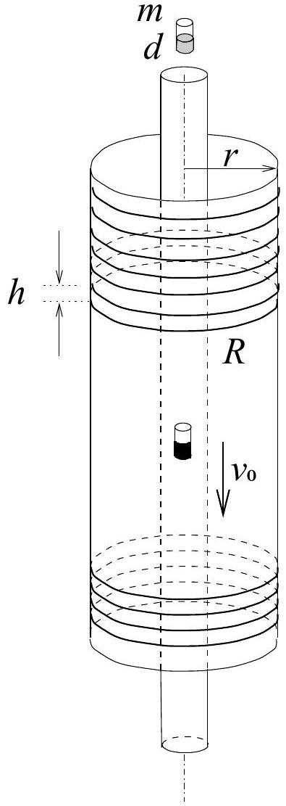

**3. Eső mágnes tekercsek között.**

Hosszú, keskeny, függőleges üvegcsövet egy vele azonos tengelyű, de sokkal szélesebb, $r$ külső sugarú másik üvegcső vesz körül. E szélesebb csövön sűrűn, egymástól $h$ távolságra elhelyezkedő, $R$ ellenállású körvezetők vannak.

Ha a keskeny csőbe egy $m$ tömegű, $d$ erősségű (mágneses dipólnyomatékú) kicsiny rúdmágnest ejtünk, az viszonylag hamar elér egy állandó $v_0$ sebességet, amellyel egyenletesen süllyed.

További kísérleteink során a fenti öt mennyiség $(m, d, h, R, r)$ közül az egyiket mindig a kétszeresére növeljük, miközben a másik négyet nem változtatjuk meg. Hányszorosára nő az egyes esetekben a kicsiny rúdmágnes állandósult végsebessége?

Az eredeti eset: $m, d, h, R, r$; ekkor $v=v_0$.

a) $(2m, d, h, R, r) ; v_a / v_0 = ?$
b) $(m, 2d, h, R, r) ; v_b / v_0 = ?$
c) $(m, d, 2h, R, r) ; v_c / v_0 = ?$
d) $(m, d, h, 2R, r) ; v_d / v_0 = ?$
e) $(m, d, h, R, 2r) ; v_e / v_0 = ?$

A mechanikai súrlódástól és a közegellenállástól, továbbá a körvezetők önindukciójától és kölcsönös indukciójától eltekinthetünk.

