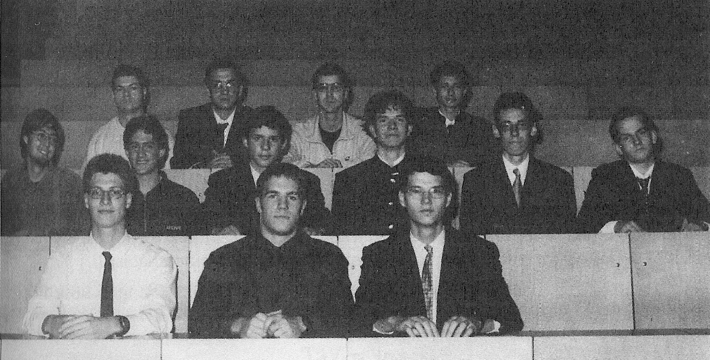

**1. Lánc a hengeren.**

Egy $R$ sugarú, sima felületű, vízszintes helyzetű, rögzített hengerhez egy apró szemű láncot kötünk úgy, hogy egyik végét a paláston, a henger tengelyével azonos magasságban fekvő $A$ pontban rögzítjük, majd a láncot egyszer átvetjük a hengeren.

Legalább mekkora legyen a függőlegesen lelógó rész $l$ hossza, hogy a lánc többi része mindenhol a henger palástjához simuljon?

*Varga István*
