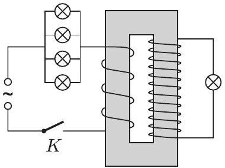

3. Egy jó minóségü transzformátor szekunder tekercsének menetszáma háromszorosa a primer tekercsének. Ezt a trafót a 11. ábra szerint hálózati váltóáramú feszültségforrásra kapcsoljuk a következő módon: A primer körbe egymással párhuzamosan iktatunk be öt egyforma, a hálózati feszültségre méretezett izzó közül négyet, az ötödiket a szekunder körbe kötjük. Mi történik a $K$ kapcsoló zárása után?

11. ábra

a) Mindegyik izzó tữrhetốen ég.
b) A primer körbeli négy izzó szépen ég, az ötödik legfeljebb pislákol.
c) A szekunder körbeli izzó egy pillanat alatt kiég, utána a primer körbeli izzók sem világítanak, mivel a primer tekercs fojtótekercsként hat.

Melyik a helyes válasz?