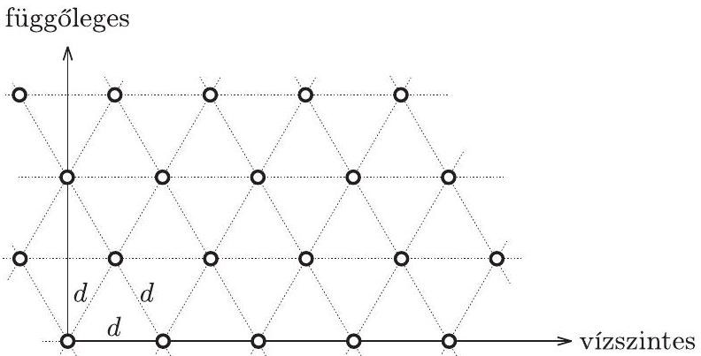

2. Egy átlátszatlan lapon kicsiny lyukak vannak az 5 . ábrán látható „háromszög-rács" elrendezésben. A lapot monokromatikus, $\lambda$ hullámhosszúságú lézerfénnyel világítjuk meg merôlegesen. A rácsállandó $d=100 \lambda$.

5. ábra

Ábrázoljuk vázlatosan (a méretek, valamint a vízszintes és a függốleges irányok bejelölésével), hogy milyen elhajlási képet figyelhetünk meg a rácstól 3 m távolságra elhelyezett ernyốn!
