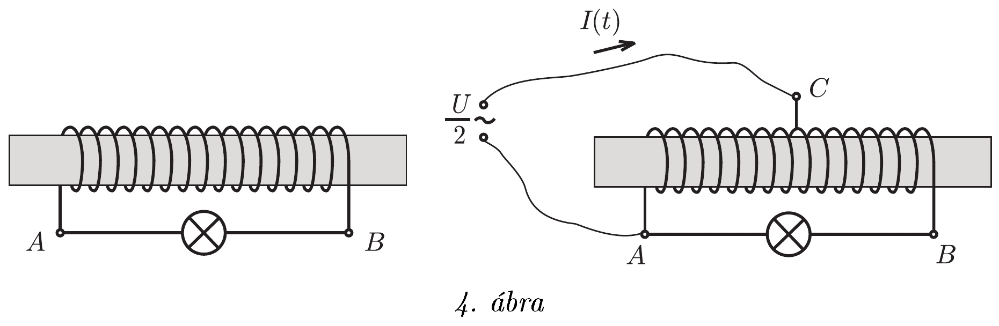

Egy terebélyes vasmaggal ellátott, nagy önindukciójú, de mégis elhanyagolható ohmikus ellenállású tekercs végeit $U$ feszültségre méretezett izzón keresztül kötjük össze. Ha az A és B pontok közé U/2 effektív értékü váltakozó feszültséget kapcsolunk, az izzó nagyon halványan világít.

Mivel a tekercs közepéről is van egy $C$ kivezetés, megpróbáljuk a feszültségforrás pólusait az $A$ és $C$ pontokhoz kötni. Megváltozik-e az izzón átfolyó áram erősségе, és ha igen, hogyan? Az ábrán bejelöltük a főágban folyó $I(t)$ pillanatnyi áram irányát. Hogyan folyik az áram ugyanekkor a tekercsben?
