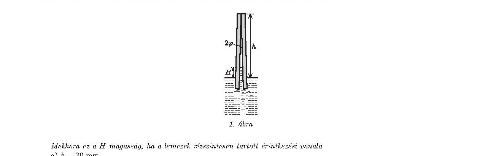

Két téglalap alakú üveglemezt egyik élük mentén egymáshoz támasztunk úgy, hogy $2 \varphi$ szöget zárjanak be egymással. Az így rögzített lemezeket lassan vízbe engedjük az ábrán látható módon. A víz, amely tökéletesen nedvesíti az üveget, a felületi feszültség hatására a két lemez között bizonyos $H$ magasságig felemelkedik.

1. ábra

Mekkora ez a $H$ magasság, ha a lemezek vízszintesen tartott érintkezési vonala

a) $h=30 \mathrm{~mm}$,
b) $h=15 \mathrm{~mm}$,

távolságra van a szabad vízfelszíntől? Ábrázoljuk vázlatosan, hogyan változik $H$ a fokozatosan csökkenő $h$ függvényében!

Feltehetjük, hogy a lemezek egymással érintkező éle sokkal hosszabb, mint $h$, továbbá a lemezek szimmetriasíkja mindvégig függőleges.

Adatok: $\sigma_{\text{víz}}=0,072 \mathrm{~N} / \mathrm{m}, \varrho_{\text{víz}}=1000 \mathrm{~kg} / \mathrm{m}^{3}, 2 \varphi=6^{\circ}$.
