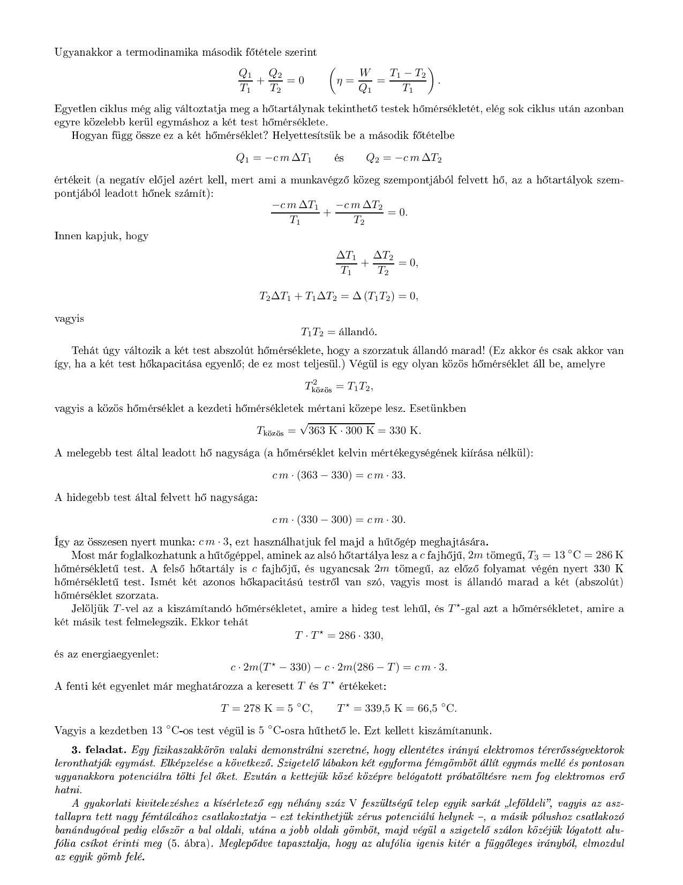

**3. feladat**

Egy fizikaszakkörön valaki demonstrálni szeretné, hogy ellentétes irányú elektromos térerősségvektorok leronthatják egymást. Elképzelése a következő. Szigetelő lábakon két egyforma fémgömböt állít egymás mellé és pontosan ugyanakkora potenciálra tölti fel őket. Ezután a kettejük közé középre belógatott próbatöltésre nem fog elektromos erő hatni.

A gyakorlati kivitelezéshez a kísérletező egy néhány száz V feszültségű telep egyik sarkát „leföldeli", vagyis az asztallapra tett nagy fémtálcához csatlakoztatja – ezt tekinthetjük zérus potenciálú helynek –, a másik pólushoz csatlakozó banándugóval pedig először a bal oldali, utána a jobb oldali gömböt, majd végül a szigetelő szálon közéjük lógatott alufólia csíkot érinti meg (5. ábra). Meglepődve tapasztalja, hogy az alufólia igenis kitér a függőleges irányból, elmozdul az egyik gömb felé.

5. ábra

Mi lehet a kudarc magyarázata? (A levegő száraz, a lábak jól szigetelnek, a gömbök sokáig megtartják a rájuk vitt töltést.)

Melyik gömb felé tér ki az alufólia?

Hogyan lehetne a kudarcot elkerülni?

(Károlyházy Frigyes)
