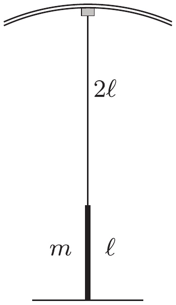

**1. feladat**

Egy cirkuszi egyensúlyozóművész egy hosszú függőleges rúdra akar felmászni. A rúd hossza $\ell$, tömege $m$. A produkció kezdetekor a rudat az egyik végéhez erősített, elhanyagolható súlyú rugalmas kötélen engedik le a cirkusz kupolájától. Amikor a rúd alja éppen a talajhoz ér, a kötél $2\ell$ hosszú (1. ábra). A kötél nyújtatlan hossza $\ell$, megnyúlása közben jól követi a Hooke-törvényt.

1. ábra

a) Milyen magasra mászhat fel a rúdra az ugyancsak $m$ tömegű artista anélkül, hogy a rúd függőleges egyensúlyi helyzete instabillá válna? (Az egyszerűség kedvéért tételezzük fel, hogy az artista mérete $\ell$-hez képest elhanyagolható.)

b) A rúd fele magasságánál az artista kicsit kibillen és a rúddal együtt oldalirányú lengésekbe kezd. Mekkora a lengés $T$ periódusideje? (A rúd alsó vége nem tud elmozdulni, de a rúd szabadon elfordulhat az alsó végpontja körül.)

(Balogh Péter)
