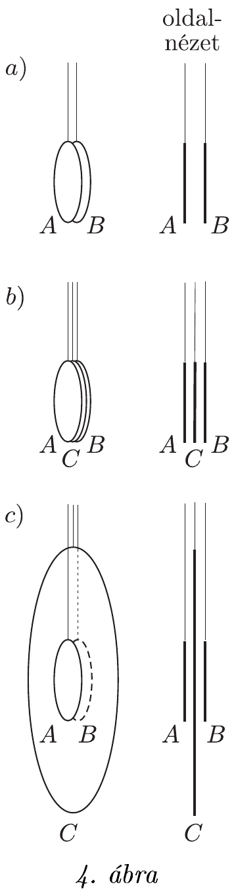

**3. feladat. Töltött korongok és árnyékolás**

Két egyforma, mondjuk 5 cm átmérőjű, vékony lemezből készült fémkorong ($A$ és $B$) szigetelő fonálon függ pontosan egymással szemben, párhuzamosan, egymáshoz közel, pl. 2 mm távolságban, az a) ábrán látható módon. Mindkét korongnak ugyanakkora, kellőképpen kicsi $q$ elektromos töltést adunk. (Mivel $q$ kicsi, sem a korongok parányi elmozdulása, sem a levegőn át történő kisülések veszélye nem okoz bonyodalmat.) Kezdetben természetesen mindkét korongra hat a másik korong taszító ereje.

Fizika szakkörön az elektromos árnyékolás a téma. A két korongot nézve Beának az az ötlete támad, hogy ha az A és B korong közé óvatosan (ügyelve, hogy egyikhez se érjen hozzá) egy ugyanolyan, de elektromosan semleges $C$ fémkorongot eresztünk be szigetelő fonálon a b) ábrának megfelelően, akkor az „leárnyékolja" mindkét eredeti korongnak a másikra gyakorolt hatását, ezért mind az $A$-ra, mind a $B$-re ható erő gyakorlatilag nullára csökken.

Gabi figyelmeztet rá, hogy az elektromos mező nagyobb tartományra terjedhet ki, mint a töltött testek mérete, ezért Bea ötletét úgy módosítja, hogy a $C$ korong átmérője legyen pl. 25 cm, ahogy a c) ábrán látható. (Az ábra nem méretarányos.) Gabi szerint csak ekkor csökken elhanyagolható értékre az $A$-ra, illetve $B$-re ható elektromos erő.

a) Mit tapasztalnánk, ha Bea ötletét követve $A$ és $B$ közé velük egyenlő méretű, semleges $C$ fémkorongot engednénk, majd megmérnénk az $A$-ra, illetve $B$-re ható erőt?

b) Mi lenne az eredmény, ha Gabi javaslatát ellenőriznénk méréssel?

c) Elképzelhető-e olyan méretű semleges $C$ korong, amelynek alkalmazásával az $A$-ra, illetve a $B$-re ható erő pontosan zérussá válik?

(Károlyházy Frigyes)
