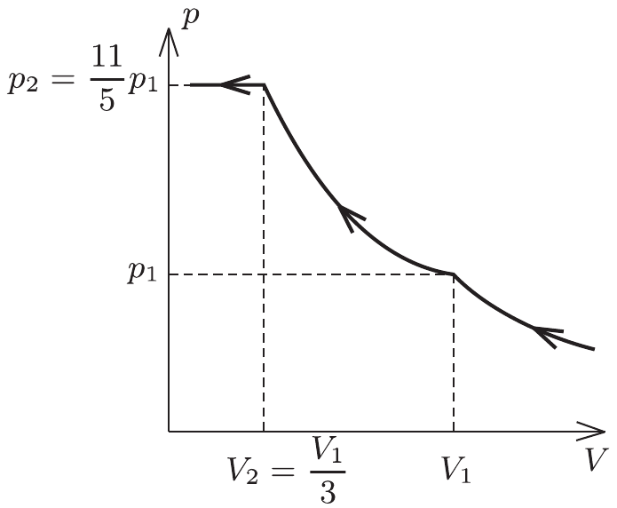

**2. feladat. Nitrogén–oxigén gázkeverék**

Egy dugattyúval ellátott tartályban $T=77,4 \mathrm{~K}$ hőmérsékletű nitrogén- és oxigéngáz keveréke található. A hőmérsékletet állandó értéken tartva a gázelegyet lassan összenyomjuk. A keverék nyomása a 2. ábrán látható módon változik a térfogat függvényében, ahol $V_{1}=15 \mathrm{dm}^{3}$ és $p_{1}=56,3 \mathrm{kPa}$.

a) Milyen fizikai jelenségek rejlenek az izotermán látható furcsa töréspontok mögött?

b) Mennyi nitrogén és mennyi oxigén van a tartályban?

(Honyek Gyula)
