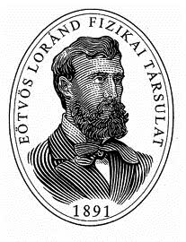

**1. feladat. Vibráló lejtő.**

Egy $L=6 \mathrm{~m}$ hosszúságú, merev deszkalap síkja a vízszintessel állandó, $\alpha=10^{\circ}$-os szöget zár be. Az így kialakított lejtő tetejére egy kis hasábot helyezünk. A deszkát a lejtésvonalával párhuzamos irányban $A=1 \mathrm{~mm}$ amplitúdóval és $\omega=500 \mathrm{~s}^{-1}$ körfrekvenciával harmonikusan rezgetni kezdjük. Mennyi idő alatt éri el a hasáb a lejtő alját? (A csúszási és tapadási súrlódási együttható értéke egyaránt $\mu=0,4$, a hasáb a mozgás során nem borul fel.)

