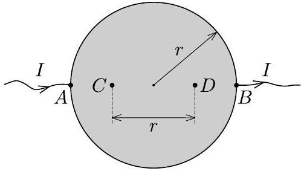

Egy $r$ sugarú, $d$ vastagságú $(d \ll r)$, $\varrho$ fajlagos ellenállású fémkorong $A$ pontjába $I$ erősségú áramot vezetünk, $B$ pontjából pedig elvezetjük azt.

Mekkora feszültség mérhető az ábrán látható $C$ és $D$ pontok között?

