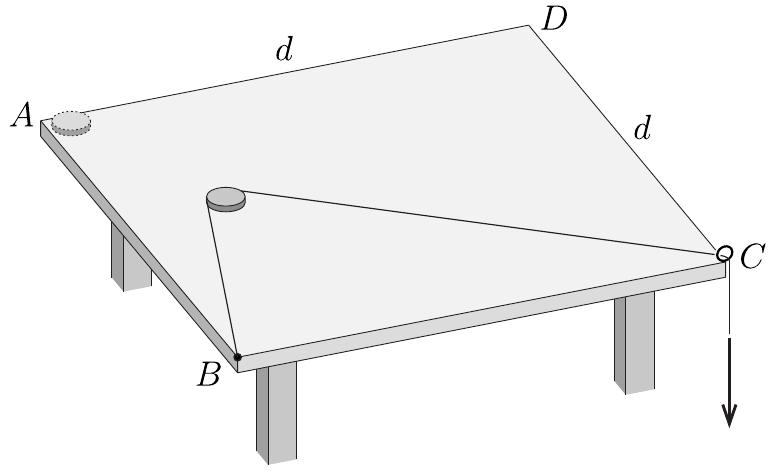

**1. feladat. Érme leesése az asztalról**

Az ábrán látható, $d$ oldalhosszúságú, négyzet alakú asztallap $A$ sarkánál egy $m$ tömegű, kis pénzérme nyugszik. Az asztal $B$ sarkához egy horgászzsinór egyik végét rögzítjük, majd a zsinórt az érmén „átvetve" az asztal $C$ sarkához rögzített szemescsavaron vezetjük át. A zsinór szabad végét igen lassan húzni kezdjük addig, amíg az érme végül leesik az asztalról. Az asztallap és az érme közötti csúszási súrlódási együttható $\mu$, máshol a súrlódás elhanyagolható.

a) Hol esik le az érme az asztalról?
b) Becsüljük meg, mennyi munkát végeztünk a folyamat közben!

Adatok: $m=7,7 \mathrm{~g}$, $d=1,0 \mathrm{~m}$, $\mu=0,3$.
