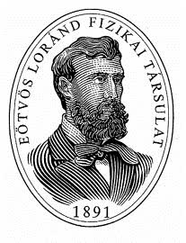

2. Könnyen gördülő, $2m$ tömegú kiskocsira egy árboc van rögzítve, aminek felső végére $\ell$ hosszúságú fonállal egy $m$ tömegú kis golyót függesztettünk. A kiskocsit egy nem túl meredek, $\alpha$ hajlásszögú lejtőre helyezzük, majd megvárjuk az inga lengéseinek lecsillapodását, és végül a kocsit elengedjük.

a) A mozgás során mennyire tér ki a fonál a függőlegestől?
b) Mekkora utat tesz meg a kiskocsi, amíg a fonál újra függőlegessé válik?
