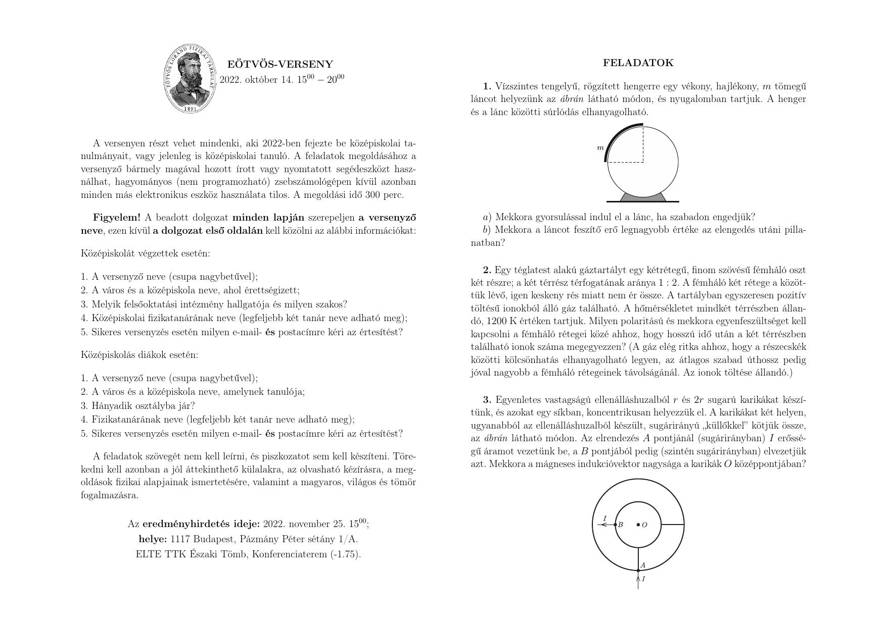

**3. feladat. Koncentrikus karikák mágneses tere**

Egyenletes vastagságú ellenálláshuzalból $r$ és $2r$ sugarú karikákat készítünk, és azokat egy síkban, koncentrikusan helyezzük el. A karikákat két helyen, ugyanabból az ellenálláshuzalból készült, sugárirányú „küllőkkel" kötjük össze, az ábrán látható módon. Az elrendezés $A$ pontjánál (sugárirányban) $I$ erősségű áramot vezetünk be, a $B$ pontjából pedig (szintén sugárirányban) elvezetjük azt. Mekkora a mágneses indukcióvektor nagysága a karikák $O$ középpontjában?

