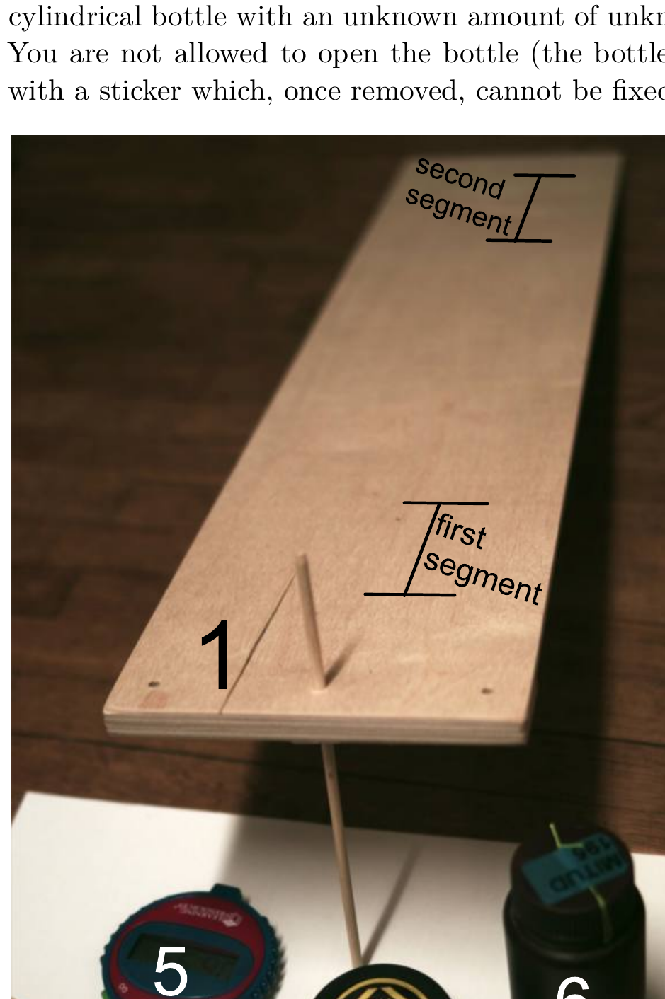

## Problem E1. Rolling cylinder (7 points)

The setup comprises of 1 a wooden board with holes drilled into its one end (the highlighted numbers correspond to the numbers in the fig.), 2 two sticks which can be put through the board's holes; this way one end of the board can be kept in an elevated position, 3 two clamps which can be mounted onto the sticks and will support the board beneath it, 4 measuring tape, 5 stopwatch (press "go" to start measuring, "stop" to record time, and "clear" to reset screen to zero), and 6 a cylindrical bottle with an unknown amount of unknown liquid. You are not allowed to open the bottle (the bottle is secured with a sticker which, once removed, cannot be fixed back).

Numerical values for your calculations: Mass of the bottle (together with the liquid inside) $M=50 \mathrm{~g}$. Free fall acceleration $g=9.81 \mathrm{~m} / \mathrm{s}^{2}$.

The properties of the liquid inside the bottle depend on temperature. To avoid heating it, keep it in your hands as briefly as possible.

When the cylinder is put onto an inclined surface, there are four possibilities what can happen.

A, if the inclination angle $\alpha$ (the angle between the surface normal and the vertical direction) is very small, $\alpha \leq \alpha_{0}$, it will remain in a resting position.
$\mathbf{B}$, for moderately small inclination angles, $\alpha_{0}<\alpha<\alpha_{1}$, the cylinder will roll down with an almost constant speed (if the angle $\alpha$ is very close to the critical value $\alpha_{0}$, the motion may be slightly uneven: the cylinder almost stops, but shortly after, resumes again rolling motion).
$\mathbf{C}$, for $\alpha_{1}<\alpha<\alpha_{2}$, once the cylinder (lying on the surface) is released, it first obtains an almost constant rolling speed; this speed is achieved very fast, upon rolling to the distance of the order of the cylinder's diameter. However, that speed will slowly increase during the course of subsequent rolling. The rolling speed grows slowly because the liquid inside the bottle will be smeared around the walls of the bottle (smearing will not take place for $\alpha<\alpha_{1}$ ).
$\mathbf{D}$, for $\alpha>\alpha_{2}$, bottle rolls from the beginning to end with an acceleration (rolling with an almost constant speed can never be observed).
Part A. Critical slopes (1 points)
Make measurements to determine the critical slopes $\alpha_{0}$ and $\alpha_{2}$. State the values of $\alpha_{0}$ and $\alpha_{2}$ (in degrees) together with uncertainties. Note that the measurement of $\alpha_{2}$ will not be very precise because the crossover from regime $\mathbf{C}$ to regime $\mathbf{D}$ is not very sharply defined.
Part B. Rolling speed (3 points)
Fix the board to a certain angle $\alpha$ with $\alpha_{0}<\alpha<\alpha_{2}$ and put the cylinder onto the board near the upper edge of the board; you will be releasing the cylinder from this position during the forthcoming measurements (the cylinder will be rolling downwards). From this position, measure 4 cm downards, and with a pencil, make a mark onto the boards. Make a next mark to a distance $l=10 \mathrm{~cm}$ downwards from the first mark. These two marks define the first = 10 cm-long-segment. When the cylinder starts rolling from the edge of the board, it will obtain a constant speed once reaching the segment. Mark a similar segment close to the lower edge of the board. Release the cylinder from a point near the upper edge of the board; measure and tabulate the data for calculating the rolling speed on both segments, as well as for the average rolling speed over the long segment from the beginning of the upper segment to the end of the lower segment. Based on your measurement data, determine the critical angle $\alpha_{1}$.
Part C. Friction force (2.3 points)
In order to keep the cylinder rolling with a constant speed $v$, a force $F$ needs to be applied. This force depends on the rolling speed $v$, and on the time $t$ elapsed from the moment when rolling started. So, $F=F(v, t)$. The dependence of $F$ on $t$ is such that at very small values of $t, F$ grows, achieves then a maximal value $F_{m}(v)$, and may slowly decrease later. Based on the measurements of the previous task, calculate and tabulate $F_{m}(v)$ for different values of $v$. Plot this dependence on a graph, and suggest a formula which describes such a dependence.
Part D. Mass of liquid (0.7 points) Based on your measurement data for the previous tasks, estimate the mass of liquid inside the bottle.
