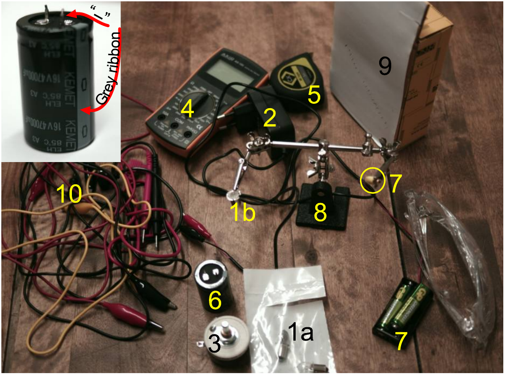
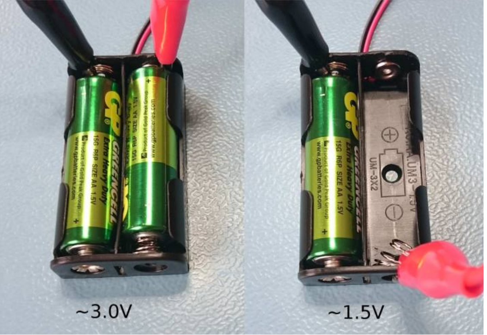

## Problem E2. Tungsten filament (13 points)

## Warnings

◇ Do not look into the laser beam or its reflections!
◇ Do not connect the electrolytic capacitor in a circuit that can result in reverse polarity on the capacitor! The grey ribbon on it denotes the "minus" side.
◇ Do not short the electrolytic capacitor with the multimeter (in ammeter mode or with the " 10 A" connector)!
◇ Use safety goggles while using the electrolytic capacitor (connecting capacitor in reverse polarity may result in an outburst of hot electrolyte)!

The setup comprises of 1a three incandescent bulbs with a tungsten filament which you can consider identical for the purposes of the experiment, 1b one broken bulb without glass, its broken filament is exposed to air (if you need few more bulbs, ask an organizer), 2 power adapter, 3 rheostat, 4 multimeter, 5 measuring tape, 6 electrolytic capacitor, 7 laser with a 3 V battery pack attached, 8 stand, 9 screen (multimeter box with a white paper attached), 10 leads (2 tester leads, 3 banana plug - crocodile clamp leads, 2 crocodile clamp - crocodile clamp leads)

Numerical values for your calculations: Wavelength of the laser $\lambda=650 \mathrm{~nm}$. Density of tungsten $D=19.25 \mathrm{~g} / \mathrm{cm}^{3}$

Specific resistance of tungsten at room temperature $\rho_{25}=$ $5.65 \times 10^{-8} \Omega \cdot \mathrm{~m}$. Function that approximates the temperature of tungsten as a function of its specific resistance fairly well for temperatures between 400 K and tungsten's melting temperature $T_{m}=3695 \mathrm{~K}$ :

$$
T\left(\frac{\rho}{\rho_{25}}\right)=104 \mathrm{~K}+216 \mathrm{~K} \cdot \frac{\rho}{\rho_{25}}-2.46 \mathrm{~K} \cdot\left(\frac{\rho}{\rho_{25}}\right)^{2} .
$$

Stefan-Boltzmann constant $\sigma=5.67 \times 10^{-8} \mathrm{~W} /\left(\mathrm{m}^{2} \mathrm{~K}^{4}\right)$. Capacitance of the electrolytic capacitor $C=47 \mathrm{mF}$. Multimeter's uncertainty: as ohmmeter 0.8\% + 5 times the last significant digit (LSD), as ammeter (10A) $2 \%+5 \times$ LSD, as voltmeter $0.5 \%+4 \times$ LSD .
Part A. Filament's diameter (1.5 points) Measure the diameter $d$ of the tungsten filament using diffraction. Use the incandescent bulb with exposed filament (the filament has been straightened from its regular coil shape). Sketch the measurement setup. Hint: the diffraction pattern from a wire is the same as from a single slit of equal diameter. In order to increase the intensity of the diffraction pattern on screen, focus the laser beam onto the filament by twisting the cap of the laser housing (the laser spot on the screen will be defocused).

If you were unable to determine the diameter, use in what follows $d=40 \mu \mathrm{~m}$ (which might not be the correct value).
Part B. Filament's resistance (2 points) Measure the resistance $R$ of the filament at the room temperature as accurately as possible. Document the circuit used. Calculate the filament's length $l$. Estimate the uncertainty. You can neglect the resistance of the bulb housing and of the wires supporting the filament. When the multimeter is used for voltage measurements, it can be considered as an ideal voltmeter. When used as an ammeter, its internal resistance cannot be neglected. Note that you can use the power supply which provides $\approx 12 \mathrm{~V}$, but if necessary, you can also use the laser battery holder as a 3 V supply or as a 1.5 V supply as shown in the image (while you use it as a 3 V supply, the laser will operate).

Part C. Current-voltage curve (2.5 points) Plot the current through the bulb as a function of voltage from 0 V until the filament breaks. Document your circuit. What was the maximum temperature $T$ of the filament when it broke?

Note that you can use multimeter in 10 A-range for current measurements; if you do so, you do not have to rebuild the circuit for measuring the voltage: when the multimeter's selector knob is turned between 10 A and voltage measurement positions, the "10A" and COM terminals remain connected inside the multimeter through a resistor of few ohms, and the resistance between the COM and multi-purpose terminals remains very large.
Part D. Emissivity (3.5 points) Assuming that (a) all of the heat from the filament is dissipated with thermal radiation, and (b) the tungsten filament is a grey body, i.e. its emissivity does not depend on temperature $T$, the Stefan-Boltzmann law predicts that the power dissipation $P=A k \sigma T^{4}$, where $A$ is the surface area of the filament and $k$ is the emissivity. Build a graph to verify this prediction. Indicate, for which range of temperatures this prediction holds, and find emissivity of the tungsten filament for that range. At which temperatures the prediction does not hold? Why the prediction fails for these temperatures?
Part E. Specific heat capacity of tungsten (3.5 points) Measure the quantity of heat $Q$ required to raise the temperature of the filament from the room temperature to its breaking temperature, and calculate average specific heat of tungsten $c$ over this range of temperatures. Document the circuit used. Estimate the magnitude of the main source of error. Hint: if you need a voltage higher than 12 V, you can use the power supply and battery pack in series to achieve voltages up to ca 15 V .
