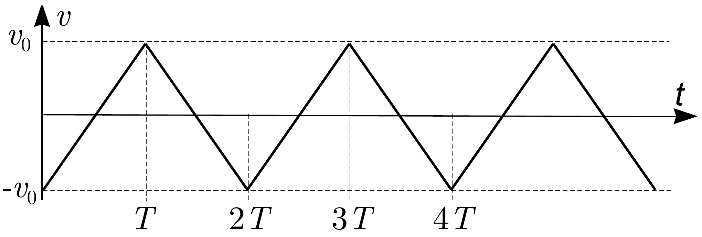

## Problem T1. Stabilizing unstable states (11 points)

Part A. Stabilization via feedback (3.5 points)
Let us study, how an initially unstable equilibrium position can be stabilized. First we consider a reversed pendulum: a thin long rod of homogeneous mass distribution and length $l$ is fixed at its lowest point to a hinge so that it can freely rotate around the hinge. We describe the position of the rod via the angle $\varphi$ between the rod and a vertical line. We shall assume that $\varphi \ll 1$ ( $\varphi$ is much smaller than 1). The free fall acceleration $g=9.8 \mathrm{~m} / \mathrm{s}^{2}$.
i. (1.5 pts) Express the angular acceleration of the rod $\ddot{\varphi}$ in terms of $\varphi$, and the parameters $l$ and $g$. Show that the inclination angle $\varphi$ as a function of time $t$ is expressed as $\varphi(t)=A \mathrm{e}^{t / \tau}+B \mathrm{e}^{-t / \tau}$, where $A$ and $B$ are constants which depend on the initial position and initial angular speed of the rod, and $\tau$ is a characteristic time. Express $\tau$ in terms of $l$ and $g$. (You may use dimensional analysis, but then you'll lose 0.5 pts.) Hint: for a rod of length $l$ and mass $m$, the moment of inertia with respect to its endpoint is $\frac{1}{3} m l^{2}$.
ii. (0.5 pts) Now, a boy tries to keep a long thin rod standing vertically on his palm. For instance, as soon as the rod starts falling leftwards, he moves his palm to an even greater distance leftwards so that the rod's centre of gravity would be positioned rightwards from the rod's support point. Then, the torque of the gravity force would rotate the rod rightwards, decreasing the previously observed leftwards angular speed. Estimate, for which rod lengths the boy can keep the rod vertically if his reaction time is estimated as $\tau_{r}=0.2 \mathrm{~s}$. (The reaction time is the time lag between the command sent by brain to hands, and the corresponding motion of the hands.)
iii. (0.5 pts) Humans and birds keep their standing position similarly and move the support centre (the point at the bottom of their feet where the total normal force is applied), e.g. by adjusting the angle between a leg and the foot, so as to oppose the falling motion of the upper part of their body. A small bird of length $l_{b}=6 \mathrm{~cm}$ can stand on its feet; estimate the upper bound for its reaction time.
iv. (1 pt) Equilibrium on a bike is also kept by displacing the support centre which lies on the line connecting the wheelground contact points; that line can be conveniently displaced by turning the handlebar while driving forth. Estimate the minimal driving speed $v_{m}$ of a bicyclist by which the equilibrium can be maintained in such a way. Assume that for the bicyclist, the characteristic falling time is the same as for a rod of length $L=2 \mathrm{~m}$; the distance between the centres of the wheels $d=1 \mathrm{~m}$.

Part B. Tightrope walker (3.5 points)
A tightrope walker cannot move the support point in the direction perpendicular to the rope. His equilibrium is kept by displacing the centre of gravity, instead. Let us make a simple model of a man balancing on a rope.

Lower half of the body is modelled by a point mass $m$ at height $H$, and the upper half of the body - by an equal point mass $m$ at the height $1.4 H$. The mutual position of these point masses can be changed by bowing right or left; for the sake of simplicity, let us assume that the distance of the point masses from the rope will remain unchanged, i.e. these behave as if being fixed to the endpoints of two thin rods of lengths $H$ and $1.4 H$ respectively, see figure. Let the rods form angles $\alpha_{1}$ and $\alpha_{2}$ with the vertical line (positive angles correspond to clock-wise rotation), so that the angle between the rods is $\beta=\alpha_{1}-\alpha_{2}$. A tightrope walker can control the value of the angle $\beta$ by bowing.
i. (1 pt) Let us assume that initially, the tightrope walker was standing in an almost perfect equilibrium $\left(\alpha_{1}=\alpha_{2}=0\right)$. Due to instability of this equilibrium, he starts slowly falling clock-wise, which he notices at $t=t_{0}$ when $\alpha_{1}=\alpha_{2}=\alpha_{0}>0$. He bows rapidly to stop falling: assume that the angle $\beta$ takes almost instantaneously a new value $\beta_{0}$. Express the new values of the angles $\alpha_{1}$ and $\alpha_{2}$ in terms of $\beta$ and $\alpha_{0}$.
ii. (0.5 pts) So, the tightrope walker is now bowing and keeps this body shape $\left(\beta=\beta_{0}\right)$ for the time period $T_{b}$, upon which he straightens himself almost instantaneously and makes thereby $\beta=0$. His aim is to resume the motionless standing position with $\alpha_{1}=\alpha_{2}=0$. Should he have bowed clock-wise $\left(\beta_{0}>0\right)$ or counter-clock-wise? Motivate your answer.
iii. (1 pt) From now on, we assume that $\alpha_{0} \ll \beta_{0}$. Immediately after he has straightened himself, neither his angular speed $\dot{\alpha}_{1}=\dot{\alpha}_{2}$ nor angle $\alpha_{1}$ are zero: zero values will be achived much later. Which value (expressed in terms of $H$ and $g$ ) should the ratio $\dot{\alpha}_{1} / \alpha_{1}$ take at that moment?
iv. (1 pt) Express the required duration $T_{b}$ in terms of $\alpha_{0}, \beta_{0}$, $H$, and $g$ assuming that $\alpha_{0} \ll \beta_{0}$.

## Part C. Kapitza's pendulum (4 points)

In 1908 Andrew Stephenson found that the upper position of a pendulum can be stable, if its suspension point oscillates with a high frequency. The explanation of this phenomenon was provided in 1951 by Russian physicist Pyotr Kapitza. In what follows we'll find the stability criterion of such a pendulum. Apart from being just a nice toy, the Kapitza's pendulum demonstrates the method of separating fast and slow processes which plays an important role in physics. High frequency oscillations can drive a slow motion in various systems, e.g. high frequency electric fields act on charges with an effective average force known as the ponderomotive force.
We consider a pendulum of length $l$, similar to that of Part-A-Question-i, but now the rod is massless, with a point mass at its end, and the suspension point oscillates vertically (see the figure). Let the velocity $v$ of the suspension point depend on time $t$ as shown in the graph below ( $v>0$ corresponds to upward motion); the oscillations' half-period $T \ll l / v_{0}$. We also assume that $v_{0} / T \gg g$ so that for questions i-ii you may ignore the free fall acceleration. In order to simplify calculations, you'll need to study this process in the frame of reference of the suspension point (keep in mind: reference frame's acceleration $\vec{a}$ gives rise to an inertial force $-M \vec{a}$ acting on a body of mass $M$ ).

i. (1.5 pts) Suppose that at $t=T / 2$, the pendulum was motionless and inclined by a small angle $\varphi_{0}$. Sketch the graph of the inclination angle $\varphi$ as a function of time, and determine the angular displacement of the pendulum $\Delta \varphi$ for the moment $t=T$, i.e. $\Delta \varphi=\varphi(T)-\varphi(T / 2)$. You may assume in your calculations that $\Delta \varphi \ll \varphi_{0}$ (this is valid because $T \ll l / v_{0}$ ).
ii. (1.5 pts) Since we still neglect gravity, only inertial force exerts a torque on the pendulum. Determine the average value of this torque (with respect to the suspension point, averaged over the full period $2 T$ ).
iii. (1 pt) Now, let us take into account that there is also the gravity field of the Earth. Determine, which inequality must be satisfied for $g, T, l$ and $v_{0}$ in order to ensure the stability of the vertical position of such a pendulum (some of these parameters may not be needed for your inequality).
