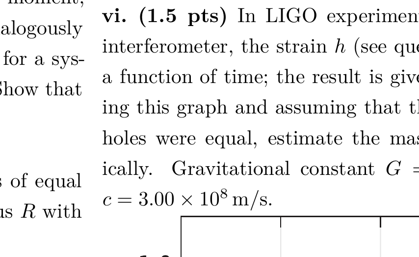

## Problem T2. Gravitational waves (10 points)

## Part A. Dipole radiation (2.4 points)

Static electric and gravity fields are described by identical set of equations - as long as we are far from black holes. However, if we add terms describing time variations of the fields, the equations become different. Therefore, expressions for electromagnetic waves cannot be directly carried over to gravitational waves. Still, for expressions given below, the difference will be only in the value of numerical prefactors.

Charges moving with acceleration lose kinetic energy by radiating electromagnetic waves; this radiation is known as the dipole radiation. The total radiation power is expressed as

$$
P_{e d}=\frac{\ddot{\vec{d}}^{2}}{6 \pi \varepsilon_{0} c^{3}},
$$

where $\ddot{\vec{d}}$ is the second time derivative of the dipole moment, $c$ is the speed of light, and $\varepsilon_{0}$ - vacuum permittivity. Dipole moment for a system of charges $q_{i}$ is defined as $\vec{d}=\sum_{i} \vec{r}_{i} q_{i}$, where $\vec{r}_{i}$ is vector pointing from the origin to the position of $i$-th charge. For harmonically oscillating dipoles, the radiated wave frequency equals to the frequency of oscillations.
i. (1.4 pts) Consider an electron of charge $-e$ and mass $m$, circulating around an atomic nucleus of charge $+Z e$ at distance $r$; neglect quantum mechanical effects. Express the total radiated power, and the wavelength $\lambda$ of the radiated waves in terms of $e, Z, m, r$, and physical constants.
ii. (1 pt) Let us try to carry over Eq. (1) to gravitational waves; then, the total radiation power $P_{g d}$ would be proportional to ${\ddot{\overrightarrow{d_{g}}}}^{2}$, where $\overrightarrow{d_{g}}$ is the gravitational dipole moment, and two dots denote the second time-derivative. Analogously to the electrical dipole, gravitational dipole moment for a system of point masses $m_{i}$ is defined as $\vec{d}_{g}=\sum_{i} \vec{r}_{i} m_{i}$. Show that always $P_{g d}=0$.
Part B. Quadrupole radiation (7.6 points)
Let us consider a binary star consisting of two stars of equal mass $M$ which rotate around a circular orbit of radius $R$ with angular speed $\omega$.
i. (1 pt) Express $\omega$ in terms of $M, R$, and constants.
ii. (0.8 pts) While there is no gravitational dipole radiation, there is a quadrupole one. In analogy with the dipole radiation, it should be proportional to squared time-derivatives of the quadrupole moment. For this problem, it is enough to know that for our binary star, the gravitational quadrupole moment components are of the order of $M R^{2}$. So, we expect the total radiation power to have a form $P_{q g}=A M^{2} R^{4}$, where the factor $A$ may depend on $\omega$ and physical constants (here $\omega$ is an independent parameter, though for a binary star it depends on $M$ and $R$ ). Find expression for $P_{q g}$ using dimensional analysis.
iii. (0.8 pts) The effect of gravitational waves is measured by strain $h=\Delta l / l$; here $l$ is a distance between two points in space, and $\Delta l$ is the change of that distance due to the wave. As usual for waves, the energy flux density $S$ (radiation energy per unit time and unit area) is proportional to the squared wave amplitude: $S=K h_{0}^{2}$ ( $h_{0}$ denotes the wave amplitude). Based on dimensional arguments, express the factor $K$ in terms of constants and the angular frequency of the wave $\omega$.
iv. (1 pt) The dipole radiation is distributed over propagation directions anisotropically, but let us ignore this: for the sake of simplicity, assume isotropic radiation. Express the amplitude $h_{0}$ of gravitational waves at distance $L$ in terms of $M, R$, and physical constants.

The energy of the binary star decreases in time due to the emission of gravitational waves. So, the distance $R$ between the two stars decreases. This process will continue until the stars collide and merge ( $R$ becomes of the order of the radius of a star). In LIGO experiment (reported on 11th February 2016), gravitational waves emitted right before a merger of two black holes were observed. For the radius of a black hole, we'll use the Schwarzschild radius $R_{s}$ which is defined as such a critical distance from a point mass $M$ that light cannot escape due to gravitational pull from distances $r<R_{s}$. To derive properly an expression for $R_{s}$, theory of general relativity is needed.
v. (1 pt) Express $R_{s}$ in terms of $M$ and physical constants. Use the following fact: if we neglect general relativity and use special relativity together with Newtonian gravitation law, we obtain a result which is exactly half of the correct one.
vi. (1.5 pts) In LIGO experiment, using a 4-km-long laser interferometer, the strain $h$ (see question iii) was measured as a function of time; the result is given in the graph below. Using this graph and assuming that the masses of the two black holes were equal, estimate the mass of each of them numerically. Gravitational constant $G=6.67 \times 10^{-11} \mathrm{~m}^{3} \mathrm{~s}^{-2} \mathrm{~kg}^{-1}$; $c=3.00 \times 10^{8} \mathrm{~m} / \mathrm{s}$.

vii. (1.5 pts) Using the same data as for question vi, estimate the distance to these black holes.
