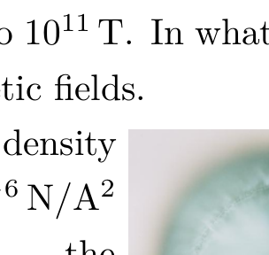
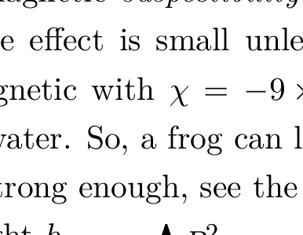
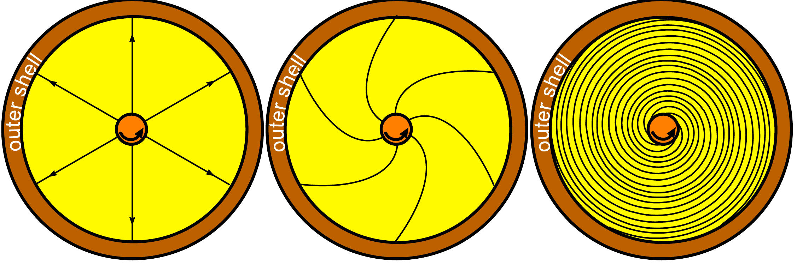

## Problem T3. Magnetars (9 points)

Magnetic fields are everywhere around us. Some typical magnetic B-field values: Earth's magnetic field: $25-60 \mu \mathrm{~T}$; at Sunspots: 0.3 T; strong permanent magnets: around 1 T; continuously maintained magnetic fields in laboratory: up to 45 T; neutron stars and magnetars: up to $10^{11} \mathrm{~T}$. In what follows we study few aspects of strong magnetic fields.

Magnetic field energy density $w=B^{2} \frac{1}{2 \mu \mu_{0}}$, where $\mu_{0} \approx 1.3 \times 10^{-6} \mathrm{~N} / \mathrm{A}^{2}$ is the vacuum permeability, and $\mu$ - the relative permeability of the medium. System tries to move towards a lower energy state and so ferromagnetic materials with

$\mu \gg 1$ are pulled towards regions with strong magnetic fields, and diamagnetic materials with $\mu<1$ are pushed out. For diamagnetic materials, the magnetic suspectibility $\chi=\mu-1$ is small, $|\chi| \ll 1$, and so the effect is small unless the field is strong. Water is a diamagnetic with $\chi=-9 \times 10^{-6}$ and animals are mostly made of water. So, a frog can levitate in a magnetic field if the field is strong enough, see the photo.
i. (1.5 pts) Let the frog height $h_{f}$ be not more than $h_{0}=10 \mathrm{~mm}$, and let us assume simplifyingly that the squared magnetic field depends linearly on height $z$, see figure. Find how strong magnetic field $B_{0}$ (in

Teslas) is needed to keep this frog in levitation. Assume that the frog is made entirely of water (density $\rho=1000 \mathrm{~kg} / \mathrm{m}^{3}$ ); free fall acceleration $g=9.8 \mathrm{~m} / \mathrm{s}^{2}$. Hint: for $|\chi| \ll 1$, we can write $w \approx B^{2} \frac{1-\chi}{2 \mu_{0}}$; hence, the energy density associated with the presence of water is $\Delta w=B^{2} \frac{1-\chi}{2 \mu_{0}}-B^{2} \frac{1}{2 \mu_{0}}=-B^{2} \frac{\chi}{2 \mu_{0}}$.

Stars are made of a plasma which is a good electrical conductor. Because of that, magnetic field lines behave as if being "frozen" into the moving plasma (this follows from the Faraday's induction law and Kirchoff's voltage law: due to the absence of electrical resistance, the voltage drop along a closed fictitious contour inside the plasma must be zero, hence the magnetic flux cannot change). If a star were to collapse into a neutron star, this effect would lead to an instantaneous increase of the magnetic field, see the sketch of the magnetic field lines before and after the collapse (recall that magnetic field strength is proportional to the density of field lines).
ii. (1 pt) Assuming that the polar magnetic field of a star is $B_{s}=100 \mu \mathrm{~T}$ and its average density $\rho_{s}=1400 \mathrm{~kg} / \mathrm{m}^{3}$, what would be its polar magnetic field strength $B_{c}$ after its collapse into a neutron star due to the compression of magnetic field lines as depicted above? The neutron star density $\rho_{n}=5 \times 10^{17} \mathrm{~kg} / \mathrm{m}^{3}$.
iii. (1 pt) In reality, magnetic fields of neutron stars are generated differently. Let us consider a very simplified model. Interior part of the star has collapsed to a neutron star's size and density, but the exterior parts remains of the same size. Assume that before the collapse, the star was rotating as a solid body with angular speed $\omega_{s}$. Express the new angular speed of the interior part of the star $\omega_{n}$ in terms of $\omega_{s}, \rho_{s}$ and $\rho_{n}$.
iv. (1.5 pts) Rotation speeds of the inner- and outer parts are different, hence the field lines will be stretched, see figure.

For the sake of simplicity: (a) we use 2-dimensional geometry, i.e. consider stars as being cylindrical; (b) while the initial field was a dipole field, we assume that it was cylindrically symmetric as shown in figure; (c) endpoints of field lines are attached to the inner cylinder (the neutron star) and to the outer cylindrical shell (the remnant of the original star). Let the initial magnetic field at the outer shell be $B_{0}$. Express the magnetic field $B$ as a function of time $t$ in the region where field lines are being stretched for $t \gg 1 / \omega_{n}$ in terms of $B_{0}$ and $\omega_{n}$.
v. (1 pt) So, the energy is converted during the star collapse as follows: gravitational energy is converted into kinetic one (let us neglect thermal energy), which is later on converted into the magnetic one. Based on this scenario, estimate the maximal strength of the magnetic field $B_{\text {max }}$ for a neutron star of mass $M_{n}=4 \times 10^{30} \mathrm{~kg}$ and radius $R_{n}=13 \mathrm{~km}$. Recall that $G=6.67 \times 10^{-11} \mathrm{~m}^{3} \mathrm{~s}^{-2} \mathrm{~kg}^{-1}$.
vi. (1 pt) Very strong magnetic fields affect chemical properties of matter by changing the shape of electron orbits. This happens when the Lorenz force acting on an orbital electron becomes stronger than the Coulomb force due to the atomic nucleus. Estimate the strength of the magnetic field $B_{H}$ needed to distort the electron orbit of an hydrogen atom which has radius $R_{H}=5 \times 10^{-11} \mathrm{~m}$. Note that $\frac{1}{4 \pi \varepsilon_{0}}=9 \times 10^{9} \mathrm{~m} / F$, $e=1.6 \times 10^{-19} \mathrm{C}$, and electron mass $m_{e}=9.1 \times 10^{-31} \mathrm{~kg}$.
vii. (2 pts) In very strong magnetic fields, atomic electron clouds take cylindrical shape. Estimate the length-to-diameter ratio $\kappa=l / d$ of such electron clouds for hydrogen atoms near a neutron star, in magnetic field $B_{n}=10^{8} \mathrm{~T}$. Note that the Planck's constant $h=6.6 \times 10^{-34} \mathrm{~J} \cdot \mathrm{~s}$. Hint: the radius of the cyclotron orbit for an electron in quantum-mechanical ground state can be estimated using uncertainty principle.
