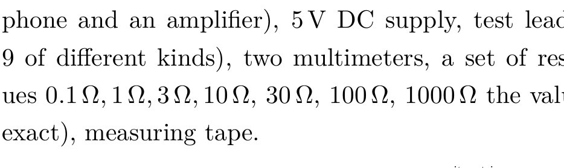
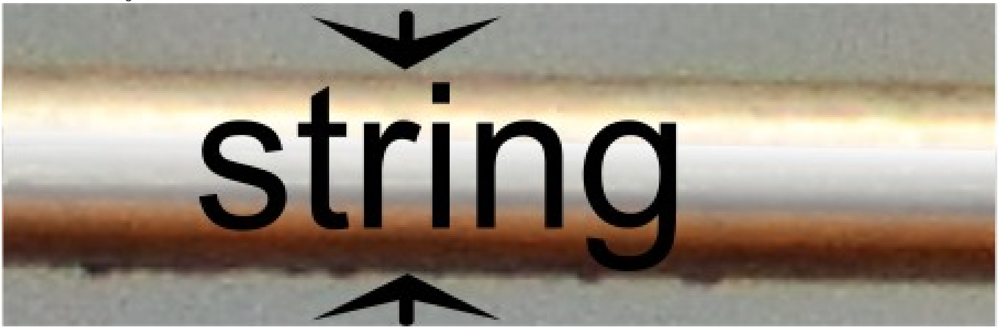
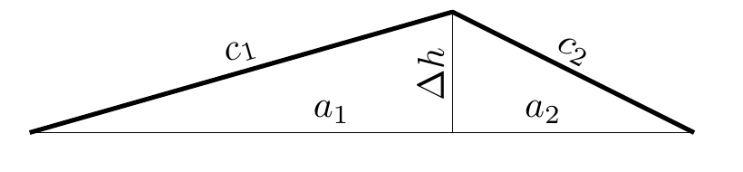

## Problem E1. Electric guitar (20 points)

In this experiment we measure different physical properties of steel guitar string material. The properties of steel vary a lot depending on the exact alloy composition and treatment. This guitar string is made of specific tempered high carbon steel (sometimes called "music wire") to get the high tensile strength required.

First we measure electrical resistivity and Young's modulus of the string material. Then we use those properties to measure the coefficient of thermal expansion of the steel. As we can see from our measurements, the temperature can creatly affect the tune of musical instruments.

## Equipment

Stand (including a guitar string, piezoelectric contact microphone and an amplifier), 5 V DC supply, test leads (in total 9 of different kinds), two multimeters, a set of resistors (values $0.1 \Omega, 1 \Omega, 3 \Omega, 10 \Omega, 30 \Omega, 100 \Omega, 1000 \Omega$ the values are not exact), measuring tape.

The stand has a guitar string tensioned over two main supports ("saddles" in guitar terminology) followed by a simple tensioner for further stretching the string. The amount of tensioning can be deduced from the number of turns of the tensioning screw. The first saddle is glued to a piezoelectric contact microphone for transforming the mechanical vibrations into an electrical signal, which is then amplified and filtered (to remove some noise) and output between S+ and S-. The contacts A and B allow you to pass a controllable electric current through the string, if connected either directly or through a resistor. One end of the string is in electrical contact with stand body (and contact B), other end is connected to 0 V. You are allowed to connect the test leads directly to stand body or string.

The smaller multimeter can be used to measure the frequency of the string oscillations from $\mathbf{S}+$ and $\mathbf{S}-$. When doing so, ensure that the USB power supply is connected; pluck the string strongly enough to hear a clear sound; take the reading when it has stabilized (immediately after plucking the string, the multimeter may show the frequency of higher harmonics). Keep in mind that the final reading may be inexact, again, because the oscillations amplitude becomes too small for the multimeter to register them. Try several times to exclude any false readings. Correct reading should be between 150 Hz and 400 Hz . The measurement is easiest for $300 \mathrm{~Hz} \ldots .400 \mathrm{~Hz}$ range, so you might want to first tension the string, measure and work down in tension from there.

WARNINGS:

◇ Do not tension the string so strongly that its fundamental frequency is over 400 Hz, otherwise you can damage the string (and ruin your measurements)!
◇ Use the 10 A input of the multimeter when measuring currents that are larger than 200 mA.

## Constants

- The pitch of the thread of the tensioning screw is $h_{1}=$ 0.70 mm (the string tensioner will rise by $h_{1}$ when the knob is turned by 360 °). Assume the string has a circular cross section.
- When heated, the relative change of the resistivity of the string is $\beta=0.0020 \mathrm{~K}^{-1}$.
- The linear density of the string at room temperature is $\Lambda=0.247 \mathrm{~g} / \mathrm{m}$.

You may assume that all the constants given in this section are exact.

## Accuracies

The accuracy of the measuring tape is ±0.5 mm. The internal resistance of the multimeters in the DC voltmeter mode is $1 \mathrm{M} \Omega$ for AX-100 and $11 \mathrm{M} \Omega$ for AX-MS811. The accuracy (maximum allowed error) of a digital multimeter is usually given in the form " $a \%+b$ " meaning $a$ percent of the reading plus $b$ units of the final digit. The values relevant for this experiment are as follows.

| Range | Accuracy of AX-100 |
| :--- | :--- |
| 200 mV... 200 V DC | 0.5\% + 4 |
| 600 V DC | 1.0\% + 5 |
| $20 ~ \mu \mathrm{~A}$... 200 mA | 1.5\% + 3 |
| 10 A | 2.0\% + 5 |
| $200 \Omega$ | 0.8\% + 5 |
| $2 \mathrm{k} \Omega \ldots 200 \mathrm{k} \Omega$ | 0.8\% + 3 |
| $20 \mathrm{M} \Omega$ | 1.0\% + 15 |

| Range | Accuracy of AX-MS811 |
| :--- | :--- |
| DC voltage | 0.7\% + 3 |
| Resistance | 2.0\% + 5 |
| Frequency | 2.0\% + 5 |

## Tasks

Part A. String dimensions (2 points) Measure the length $l_{1}$ of the part of the string that is under tension. Estimate its uncertainty. You can assume that in the least tensioned position, the string is unbent over tensioner and that the string supports are small enough so that you can ignore the error from their curvature.

Here is a photo of the string, magnified $100 \times$. From the photo, measure the diameter $d$ of the string. Estimate its uncertainty.

Part B. Resistivity (3 points) The electric resistance between the ends of a cylindrical piece of material is characterized by its resistivity $\rho=R A / l$, where $R$ is its resistance, $A$ its cross section area and $l$ its length.

Measure as exactly as possible the resistivity $\rho$ of the string at room temperature. Estimate the uncertainty. Draw the circuit diagram used, indicating the exact placement of all the used leads, which multimeter(s) you used and what were their settings.
Part C. String oscillations (3 points) A string on a guitar is characterized by its fundamental frequency - the lowest frequency of its free oscillations. Measure and plot how the fundamental frequency $f$ of the string depends on its length $l$.

To find the length, you may use the following approximation:

$$
\Delta l=c_{1}+c_{2}-a_{1}-a_{2} \approx \frac{\left(a_{1}+a_{2}\right)(\Delta h)^{2}}{2 a_{1} a_{2}},
$$

where the lengths are defined in the figure.
Part D. Young's modulus of the string (4.5 points) The elasticity of a cylindrical piece of material can be characterized by its Young' modulus $E=F l_{0} /\left(A\left(l-l_{0}\right)\right)$, where $F$ is the applied tension (or compression) force, $A$ is its cross section area, $l_{0}$ is the original (unstretched) length and $l$ is the final (stretched) strength. It is known that waves travel along the string with a speed $v=\sqrt{F / \Lambda}$, where $F$ is the tension force and $\Lambda$ is the linear density (mass per unit length) of the string. (Note that string oscillations are standing waves.)

Using the results of the previous task, plot an appropriate graph for finding the Young's modulus of the string. Find it and estimate the uncertainty.

Part E. Heated string (3 points) You can heat the string by passing some electric current through it (by connecting A and B either directly or through a resistor). At some fixed length, measure and plot how its fundamental frequency $f$ depends on its temperature $T$. Hint: Temperature can be determined by measuring the resistance of the string and using $\beta=0.0020 \mathrm{~K}^{-1}$; for room temperature use $T_{0}=293 \mathrm{~K}$.

Part F. Thermal expansion of the string (4.5 points) When heated, the length (and similarly the width) of a piece of material follows the formula $l=l_{0}\left[1+\alpha\left(T-T_{0}\right)\right]$, where the constant $\alpha$ is called the coefficient of linear heat expansion, $l_{0}$ is the original length, $T_{0}$ the original temperature, $l$ the final length and $T$ the final temperature. Note that if stretching is also involved, then this formula describes only the unstretched length!

Plot the results of the previous task in appropriate axes for finding the coefficient of linear heat expansion $\alpha$ for the guitar string. Find it and estimate the uncertainty.
