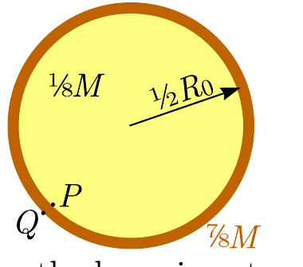

## Problem T1. Main sequence stars (11 points)

In all your subsequent calculations you may use the following physical constants and their numerical values.
Stefan-Boltzmann constant $\sigma=5.670 \times 10^{-8} \mathrm{~W} /\left(\mathrm{m}^{2} \mathrm{~K}^{4}\right)$
(Note that $\sigma T^{4}$ gives the black body thermal radiation power per unit area at temperature $T$.)
Boltzmann constant $k_{B}=1.38 \times 10^{-23} \mathrm{~m}^{2} \cdot \mathrm{~kg} \cdot \mathrm{~s}^{-2} \cdot \mathrm{~K}^{-1}$.
The rest mass of a proton $m_{p}=1.67 \times 10^{-27} \mathrm{~kg}$.
Rest energy of a proton $m_{p} c^{2}=938 \mathrm{MeV}$,
where $1 \mathrm{MeV}=1.6 \times 10^{-13} \mathrm{~J}$.
Rest energy of a helium nucleus $m_{\mathrm{He}} c^{2}=3727 \mathrm{MeV}$.
Rest energy of an electron and positron $m_{e} c^{2}=0.5 \mathrm{MeV}$.
Speed of light $c=3 \times 10^{8} \mathrm{~m} / \mathrm{s}$,
Universal gas constant $R_{g}=8.31 \mathrm{~J} \cdot \mathrm{~K}^{-1} \cdot \mathrm{~mol}^{-1}$
Avogadro's number $N_{A}=6.02 \times 10^{23} \mathrm{~mol}^{-1}$

## Part A. Lifetime of Sun (3 points)

For this Part, the following values can be also used.
The mass of Sun $M_{\odot}=2 \times 10^{30} \mathrm{k} g$.
The radius of Sun $R_{\odot}=7 \times 10^{8} \mathrm{~m}$.
Surface temperature of Sun $T_{\odot}=6 \times 10^{3} \mathrm{~K}$.
i. (0.7 pts) The Sun emits thermal radiation as a perfectly black body. Determine the total radiation power of the Sun (in watts).
ii. (0.5 pts) The Sun maintains its temperature owing to the fusion reaction, the net effect of which can be written as $4 p^{+} \rightarrow{ }^{4} \mathrm{He}^{2+}+2 e^{+}+2 \nu_{e}$, where $p^{+}$denotes a proton, ${ }^{4} \mathrm{He}^{2+}$ - a helium nucleus, $e^{+}$- a positron, and $\nu_{e}$ - an electron neutrino of negligible rest energy. Show that the energy released by such a fusion of four protons is $W_{0}=24 \mathrm{MeV}$.
iii. (0.5 pts) Antimatter cannot co-exist with matter: upon meeting, a positron and an electron disappear by producing two photons. How much energy per each fusion of four protons into a helium nucleus must leave Sun (carried away by photons and neutrinos) in order to keep it at a thermal equilibrium?
iv. (1.3 pts) Assuming that only the central part of the Sun (the Sun's nucleus) which makes $\frac{1}{8}$ of the total mass of the Sun is hot enough for fusion reaction to take place, and neglecting the energy carried away by neutrinos, estimate the total lifetime of the Sun. Note that there is no convection in the central parts of the Sun, and therefore the particles inside the Sun's nucleus remain trapped therein. Based on your result, comment on the current age of Sun, $\tau_{\odot}=5 \times 10^{9} \mathrm{y}$.

## Part B. Mass-luminosity relationship of stars (4.5 points)

Inside the nuclei of the so-called main sequence stars (such as our Sun), the fusion reaction takes place in a stable regime: if fluctuations were to increase the reaction rate slightly, the increased thermal output would lead to an increase of the pressure, to a thermal expansion of the fusion plasma, and as a result, to a decrease of the reaction rate. The reaction rate grows very rapidly with temperature and because of that, even if the reaction rates in different stars of different masses may differ considerably, the interior temperatures remain fairly similar. In what follows, you may assume that the temperature of the nuclei of stars is independent of the stellar mass and equal to

$$
T_{c}=1.8 \times 10^{6} \mathrm{~K} ;
$$

this approximation holds particularly well for stars larger than Sun.

In order to make our next calculations mathematically easier, we make the following additional approximations.
(a) The mass of the stellar core is $\frac{M}{8}$ and its radius is $\frac{R_{0}}{2}$, where $M$ is the total mass of the star and $R_{0}$ - the radius of the star.
(b) The mass density $\rho_{c}$, pressure $p_{c}$, and temperature $T_{c}$ inside the stellar core can be approximately taken to be constant throughout its volume.
(c) For tasks i-iv, we assume also that all the mass $\frac{7}{8} M$ of the outer layers of the star is concentrated into a very narrow spherical layer of radius $\frac{R_{0}}{2}$ around the core, see

figure. In reality, this is certainly not true - the layer is not narrow. However, this approximation will have only a minor effect on the expression for the pressure (in task iv).
i. (0.4 pts) Express the free fall acceleration immediately above the narrow spherical layer (point $Q$ in figure) in terms of $M$ and $R_{0}$.
ii. (0.4 pts) Express the free fall acceleration immediately beneath the narrow spherical layer (point $P$ in figure).
iii. ( $\mathbf{0 . 4}$ pts) Express the gravity force acting on a small piece of the narrow spherical layer in terms of its surface area $A, M$ and $R_{0}$.
iv. ( $\mathbf{0 . 4}$ pts) Express the pressure $p_{c}$ in terms of the radius $R_{0}$ and mass $M$ of the star; (we overestimate it only by a factor which is less than two).
v. (1 pt) Derive another expression for the pressure $p_{c}$, this time in terms of $R_{0}, M$, and the core temperature $T_{c}$. Assume that the nucleus of a star is made of a fully ionised hydrogen, i.e. there are free protons and free electrons, both of which can be described as an ideal gas.
vi. (0.4 pts) Based on your previous results, express the radius $R_{0}$ of a star in terms of its mass $M$ and temperature $T_{c}$.
vii. (1.5 pts) The radiative power of a star is limited by at which rate the produced heat can travel through the outer layers of the star and reach the surface. The heat conductivity $\kappa$ is defined as the proportionality coefficient between the heat flux
density (thermal power per unit area) and temperature gradient $\frac{\mathrm{d} T}{\mathrm{~d} r}$, where $r$ is the distance from the centre of the star. For a plasma, the heat conductivity is inversely proportional to its density, $\kappa=f(T) / \rho$. Assume simplifyingly that $\kappa$ is constant throughout the bulk of a star, up to the near-surface regions at $r=R_{0}$ where the temperature $T \ll T_{c}$, and is equal to $\kappa=f\left(T_{c}\right) / \rho_{c}$. Show that the total radiative power $P$ of a star is proportional to $M^{\gamma}$, and find the exponent $\gamma$.
Part C. Proton-proton fusion chain (3.5 points)
We say that a constant is fundamental if it cannot be expressed in terms of other fundamental constants; for instance, the StefanBoltzmann constant can be expressed in terms of $k_{B}$, speed of light $c$, and Planck's constant $\hbar$. However, majority of the fundamental constants are created artificially by physicists due to a non-fundamental way of choosing the units. For instance, SI system of units needs electrostatic constant $k_{e}$, but for Gauss system of units, charge units are such that $k_{e}=1$. So, majority of the "fundamental" constants are not really that fundamental, and depend on our (essentially arbitrary) choice of units. However, there are also dimensionless combinations of physical constants, which can be considered as the parameters of our Universe, and which define the way in which matter and fields evolve.
i. (1.5 pts) Find a dimensionless combination $\alpha^{-1}$ and calculate its value using the following subset of fundamental constants (it may happen that only few constants will enter the expression for $\alpha^{-1}$ ):

$$
\begin{aligned}
& c=3 \times 10^{8} \mathrm{~m} / \mathrm{s} \\
& G=6.67 \times 10^{-11} \mathrm{~m}^{3} \cdot \mathrm{~kg}^{-1} \mathrm{~s}^{-2} \\
& k_{B}=1.38 \times 10^{-23} \mathrm{~J} \cdot \mathrm{~K}^{-1} \\
& N_{A}=6.02 \times 10^{23} \mathrm{~mol}^{-1} \\
& \hbar=\frac{h}{2 \pi}=1.05 \times 10^{-34} \mathrm{~J} \cdot \mathrm{~s} \\
& e=1.6 \times 10^{-19} \mathrm{C} \\
& k_{e}=\frac{1}{4 \pi \varepsilon_{0}}=8.99 \times 10^{9} \mathrm{~m} \cdot \mathrm{~F}^{-1}
\end{aligned}
$$

Note that any power of $\alpha$ is also dimensionless; you are asked to find the simplest combination of constants which yields $\alpha^{-1}>1$.
Hint: before applying dimensional analysis, all units need to be expressed using the base units (m, s, A, K, kg, mol).
ii. (1 pt) The first and limiting step in the fusion of four protons into a helium atom inside a star of sub-solar mass is the fusion of two protons,

$$
p^{+}+p^{+} \rightarrow{ }^{2} \mathrm{H}^{+}+e^{+}+\nu_{e} .
$$

This process is obstructed, however, by a coulomb repulsion of two protons. You may assume that until the distance between the centres of two protons remains larger than the proton radius $r_{p}=0.85 \times 10^{-15} \mathrm{~m}$, there is only a Coulomb force; at distances smaller than $r_{p}$, an attractive strong force steps into play and dominates over the Coulomb force. Estimate the temperature $T^{\prime}$ required for the fusion of two protons if there were no quantum-mechanical effects. Compare this result with the value of $T_{c} \approx 1.8 \times 10^{6} \mathrm{~K}$.
iii. (1 pt) What enables the fusion of stellar hydrogen is the quantum-mechanical tunnel effect. With this task, you'll learn that the fusion reaction rate depends on the dimensionless parameter $\alpha$, thus we can say that the parameter $\alpha$ defines the production rate of heavier nuclei in our Universe. (It appears that in a slightly different Universe with a slightly different value of $\alpha$, no carbon nuclei neccessary for the existance of life would have been produced ${ }^{1}$.)

It appears that a particle can tunnel through an energy barrier (a region in space where the potential energy $\Pi(r)$ is larger than the total energy $W$ ) with probability

$$
p \approx \exp \left\{-2 \hbar^{-1} \int \sqrt{2 m[\Pi(r)-W]} \mathrm{d} r\right\}
$$

where the integral is to be taken over the range at which $\Pi(r)>W$. Express the tunnelling probability for the protonproton fusion reaction for head-on collision of two countermoving protons of speed $v$ in terms of $\alpha, v$ and $c$. You may assume that the proton radius $r_{p}$ is much smaller than the radius $r_{\star}$ at which the proton "dives into the tunnel" $\left[\Pi\left(r_{\star}\right)=W\right]$, and make use of the equality $\int_{0}^{a} \sqrt{\frac{1}{x}-\frac{1}{a}} \mathrm{~d} x=\frac{\pi}{2} \sqrt{a}$.

[^0]
