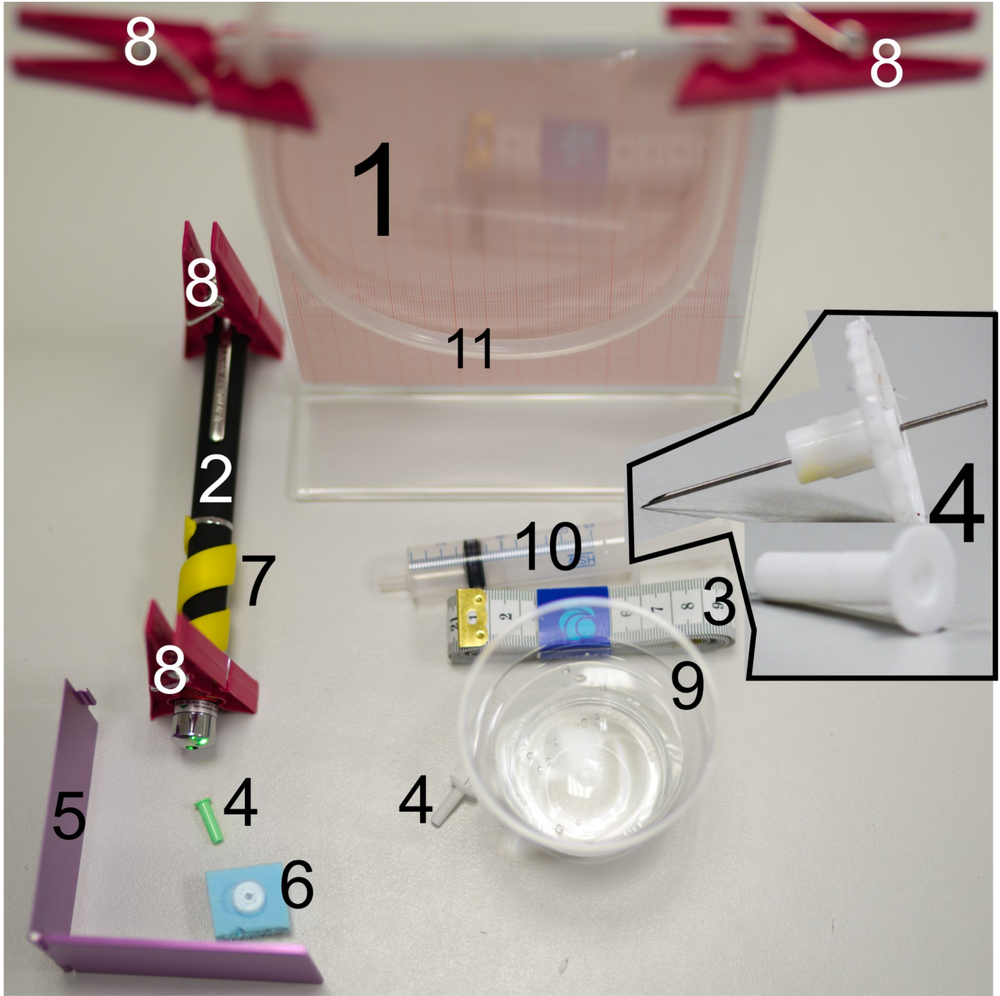
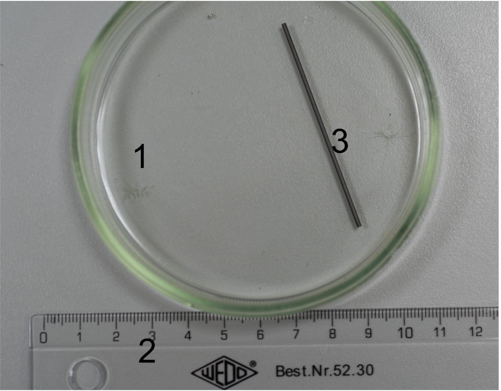
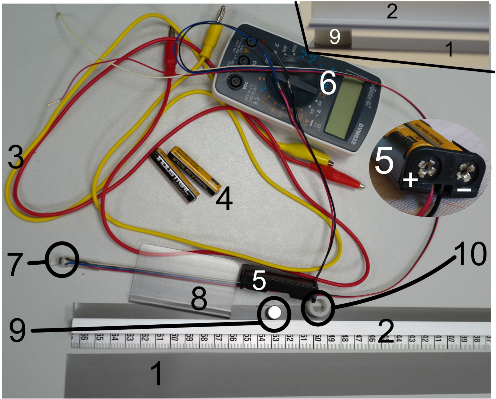
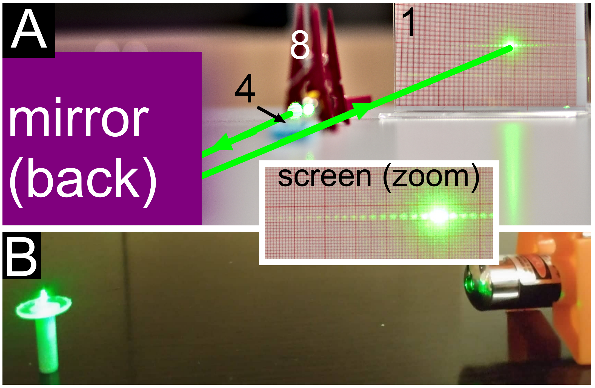
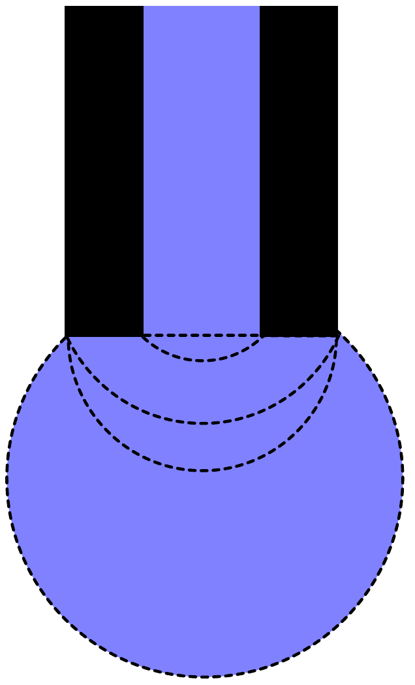
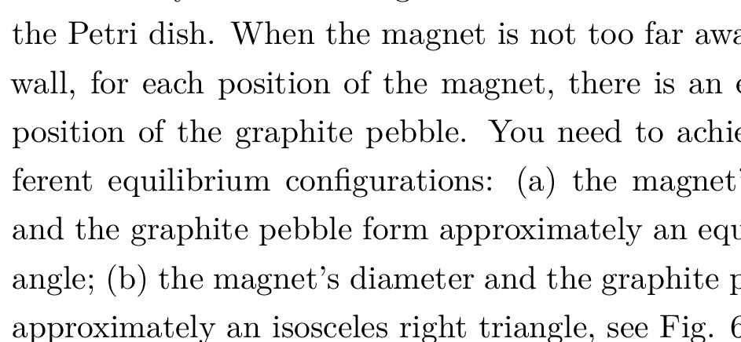
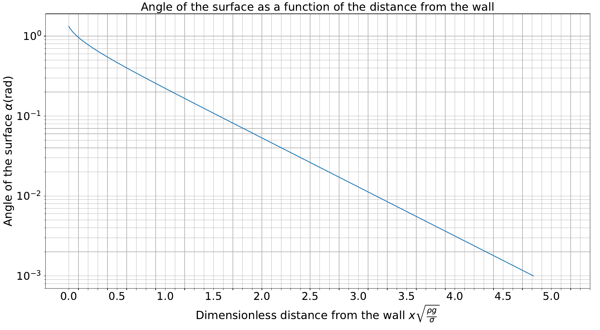
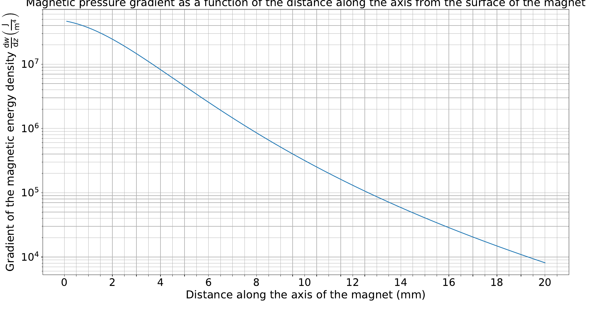

## Problem E1. Magnetic properties of matter (20 points)

The aim of this experiment is to measure magnetism-related characteristics of dia- and ferromagnetic materials. To reach this goal, some other measurements are also required - e.g. measuring the diameter of the syringe needle, and the coefficient of surface tension of water.

## Equipment

Figure 1

The following equipment is listed in figure 1:
1 - a stand;
2 - green laser pointer
3 - a measuring tape;
4 - green and white syringe needles, one end of the needle is sharp, and the other end is cut perpendicularly to its axis, see the insert in fig 1
5 - a foldable mirror
6 - a piece of foam
7 - a spiral plastic fixator that keeps the laser pointer button pressed;
8 - clothespins;
9 - a cup with water;
10 - a syringe;
11 - a silicone tube,

Figure 2

The following equipment is listed in figure 2:
1 - a Petri dish;
2 - a ruler;
3 - a graphite bar.

Figure 3

The following equipment is listed in figure 3:
1 - a stand-alone ferromagnetic strip;
2 - a ferromagnetic strip reinforced with an aluminium bar and equipped with a measuring tape;
3 - wires with crocodile clips;
4 - batteries;
5 - a battery holder;
6 - a multimeter;
7 - a resistive magnetic field sensor;
8 - a plastic clamp for fixing the orientation of the sensor;
9 - a magnet;
10 - a plastic spacer to keep the strip (2) strictly horizontal.

Not shown in the figures: a piece of polyethylene film for wrapping the magnet.

WARNINGS:

◇ Do not bend the ferromagnet, as it will become unusable! If bent, no replacement will be provided and you will get no marks for that part.
◇ Avoid direct or reflected laser beams hitting your eye, this can be harmful to your eye!
◇ The syringe needles are sharp, avoid puncturing yourself!
◇ Avoid short-circuiting the battery leads - the battery will overheat and become unusable!
◇ Power off the multimeter and the laser when not in use, in order to conserve the batteries.

Tasks

Part A. Diameter of the syringe needle (3 points)
Determine the diameter of the syringe needles using the following procedure.

Put the syringe standing vertically onto table, with its plastic cap downside as shown in Fig 4B, install the laser with the help of the clothspins as shown in the figure, and direct the laser beam onto the needle. If the laser beam is too high (i.e. passes the needle above it), you may use the piece of foam as shown in Fig 4A (insert the sharp end of the green syringe needle into the foam so that it will stand vertically). If the laser beam is slightly too low, you may use a folded sheet of paper to raise it. If the laser runs out of battery, you may ask for a replacement. Use the mirror to increase the length of the laser beam (see Fig 4A). Measure the distance between diffraction maxima on the screen as precisely as possible (explain how you achieved the best possible accuracy). Measure the length of the light beam from the syringe needle to the screen and calculate the diameter of the needle. Wavelength of the laser beam is $\lambda=532 \mathrm{~nm}$.

Estimate the uncertainty of your result. Repeat the procedure with the white needle.

Figure 4

Part B. Surface tension of water (4 points)
Fill the silicon tube with water - you may use the syringe (do not use the needle!) so that approximately 2/3rd of it is filled with water (adjust the amount of water as needed later); make sure that the water forms a continuous column with no air gaps. Using clamps, fix the tube from its two ends to the screen (which is now used as a stand). Insert the green syringe needle into the tube by puncturing it with the sharp end of the needle. Make sure to puncture the tube perpendicularly near its centre, so that the flat end of the needle will point vertically downwards. Depending on the height of the water column above the open end of the needle, water may or may not start slowly dripping out. If it does not drip, lower the needle by pulling the tube from its middle part downwards so that it will start approaching a V-shape. If water still does not start dripping, add more water into the tube (if even this is not enough, ask for a replacement needle).

While the water is slowly dripping from the needle, raise very slowly the needle to determine, at which height will the dripping stop, and measure the corresponding water column height (the height difference between the water level in the tube, and the lowest point of the needle).

Hint: when the tube is hanging in a U-shaped manner, the height of the water column can be adjusted by pulling the tube from its middle point into a V-shape, or raising it into a Wshape.

Make several measurements with the green needle, and repeat the whole procedure with the white needle. State your results for the critical water column heights together with the uncertainties, for the both needles. Based on your measurements, determine the coefficient of surface tension $\sigma$ for water, alongside its uncertainty. Density of water is $\rho_{w}=1000 \mathrm{~kg} / \mathrm{m}^{3}$, free fall acceleration $g=9.81 \mathrm{~m} / \mathrm{s}^{2}$.

Hints: different stages of the droplet growing from the end
of the syringe needle are shown in Fig 5. Surface tension gives rise to a pressure drop over a curved water surface; in the case of a spherical surface, this pressure drop equals to $\Delta p=2 \sigma / r$, where $r$ is the radius of the spherical surface.

Figure 5

## Part C. Susceptibility of graphite (4 points)

Measure the diameter of the magnet and write down the result.

Fill the Petri dish with water so that the water layer depth is approximately half of the dish height. Break a tiny piece from the graphite bar and put it onto the water; it should remain floating owing to surface tension.

Fix the magnet to the syringe as shown in Fig. 6 (magnet's axis should be parallel to the syringe) with the help of a piece of the polyethylene film. Orient the magnet approximately under 45 degrees to the horizon (so that the angle between the syringe and vertical direction equals approximately to the angle between the syringe and the horizontal plane). When you move the magnet closer to the piece of graphite, it will "swim" away due to diamagnetism. Push it towards a wall of the Petri dish. When the magnet is not too far away from the wall, for each position of the magnet, there is an equilibrium position of the graphite pebble. You need to achieve two different equilibrium configurations: (a) the magnet's diameter and the graphite pebble form approximately an equilateral triangle; (b) the magnet's diameter and the graphite pebble form approximately an isosceles right triangle, see Fig. 6.

Figure 6

Using the ruler, measure the distance between the pebble and the wall of the dish for the both configurations; repeat measurements several time to reduce uncertainty.

The pushing force exerted on the graphite pebble per unit mass of the pebble is given by the formula

$$
\frac{F}{m}=\left(\left|\chi_{g}-\chi_{w}\right|\right) \frac{1}{2 \mu_{0}} \frac{\mathrm{~d} B^{2}}{\mathrm{~d} z},
$$

where $\chi_{g}$ and $\chi_{w}=-9.05 \times 10^{-9} \mathrm{~m}^{3} / \mathrm{kg}$ are the specific susceptibilities of the graphite and of the water (per unit mass of the material), and $\frac{1}{2 \mu_{0}} \frac{\mathrm{~d} B^{2}}{\mathrm{~d} z}$ denotes the magnetic pressure gradient.

Fig. 7 shows the water surface slope angle $\alpha$ as a function of the horizontal displacement $x$ from the vertical wall of the dish, normalized to the characteristic length scale $\sqrt{\sigma / \rho_{w} g}$. Here $\rho_{w}=1000 \mathrm{~kg}$ is the density of water, and $g=9.81 \mathrm{~m} / \mathrm{s}^{2}$ is the free fall acceleration. The graphite pebble will rest at very small angles so that the approximation $\alpha \ll 1$ can be used.

Fig. 8 shows the magnetic pressure gradient at the magnet's axis as a function of distance from the flat face of the given permanent magnet.

Based on these data and your measurements from before, determine $\chi_{g}$ and estimate its uncertainty.
Part D. Relative permeability of ferromagnetic strip (9 points)
i. (1 pt) Measure the voltage $\mathcal{E}$ on the output leads of the battery holder using the multimeter by connecting multimeter to the leads shown as "+" and "-" in the insert of Fig 3 and switching it to 20 volt (DC) range. If the voltage is below 3.0 V, you may ask for replacement batteries.

Connect the blue and black wires of the magnetic sensor to the batteries in the battery holder, and the red and white wires to the multimeter. If the plastic clamp is put around the four wires near the sensor as shown if Fig 3, the sensor is kept in such a position that vertical magnetic field will be measured. Switch on the multimeter in 200 millivolt (DC) range, put the sensor onto table far away from the magnet and the ferromagnetic strips, take the reading of the multimeter $V_{0}$, and write it down. Subtract this voltage reading from all the subsequent readings (to compensate for the zero offset of the sensor, and for the magnetic field of the Earth).
ii. (4 pts) If the battery voltage were to be exactly 3 V, each millivolt in the reading would correspond to 10 microteslas of the magnetic field strength. However, the reading is proportional to the battery voltage.

Put the stand-alone ferromagnetic strip onto table; place the magnet and the plastic cylindrical spacer onto it, as close as possible to its endpoints (see the insert of Fig 3), and the reinforced strip onto the whole assembly so that a gap of constant
width is formed between the strips. Measure the magnetic field strength $B=B(z)$ between the two strips as a function of distance $z$ from the magnet-less end of the strips. Start with the farthest possible position from the magnet, with $z$ equal to a few millimeters, and use 5 cm increments. For each distance $z$, move the sensor between the strips horizontally to find the largest possible reading. Tabulate your direct voltage readings together with the corresponding magnetic field strengths.

Theory predicts that in this configuration, the magnetic field between the strips is

$$
B=B_{0} \cosh (z / \lambda),
$$

where

$$
\lambda=\sqrt{\mu \delta h / 2}
$$

and the hyperbolic cosine is defined as $\cosh x=\frac{1}{2}\left(\mathrm{e}^{x}+\mathrm{e}^{-x}\right)$. Here, $\delta=0.27 \mathrm{~mm}$ stands for the strip thickness and $h$ - for the width of the gap between the two strips. This can be measured using a ruler. Based on your measurements data, draw an appropriate graph to determine the relative magnetic permeability $\mu$. Find $\mu$ and estimate the uncertainty of your result.

Hints: the given expression for $B(z)$ fails due to the saturation effect if the magnetic field inside the ferromagnetic strip is too large. Calculators usually do have both cosh-function, as well as its inverse function, denoted as acosh or $\cosh ^{-1}$.
iii. (2 pts) In order to understand how the magnetic flux is distributed over the width of the strip, measure the magnetic field strength as a function of the distance $s$ from the symmetry axis of the strip for a certain fixed value of $z$ in the middle of its range; use 4 mm-increments and decrease these increments wherever appropriate. Plot the results. Comment on your results.
iv. (2 pts) Assuming that the distribution of the magnetic flux over the width of the strip is almost independent on $z$, calculate and plot the magnetic field strength inside the ferromagnetic strip as a function of $z$ based on your measurement data (you may take additional measurements if needed). Estimate the field strength $B_{s}$ by which the magnetization of the ferromagnetic material starts becoming saturated.

Figure 7

Figure 8
